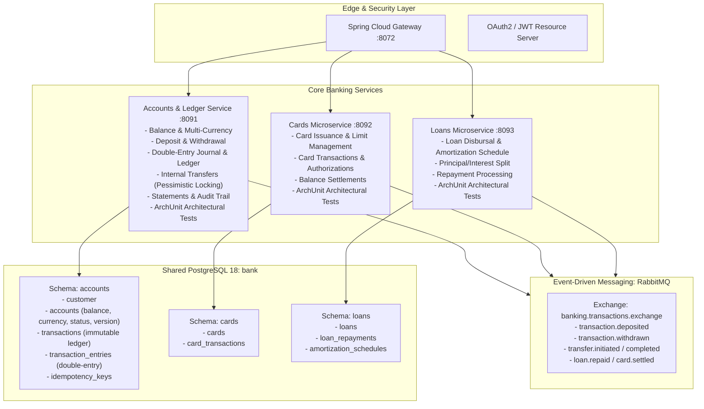

# Enterprise Banking Platform Architecture & Evolution Plan

## Executive Summary & Target State

The current SecuredBank application provides basic CRUD operations across customer profiles, accounts, cards, and loans, but lacks monetary transactions, balances, ledgers, concurrency safety, and transfer mechanisms.

This plan details the architectural blueprint and phased roadmap to elevate SecuredBank into a production-grade enterprise banking platform with financial-grade precision, double-entry bookkeeping, ACID compliance, idempotency, event-driven workflows, and automated **ArchUnit** architectural governance to enforce code quality and layering boundaries to the letter.



---

## 🏛 1. Architectural Fitness Testing with ArchUnit (Zero-Tolerance Governance)

To ensure the enterprise architecture is followed "to the T", we incorporate **ArchUnit** (`com.tngtech.archunit:archunit-junit5`) across `accounts`, `cards`, and `loans`. ArchUnit inspects compiled Java bytecode in standard `./gradlew test` runs in milliseconds, instantly failing CI/CD if any rule is broken.

### 1.1 Core ArchUnit Rules to Enforce

1. **Strict Layered Architecture**:
   - `Controller` layer may not be accessed by any other layer.
   - `Service` layer may only be accessed by `Controller` or other `Service` classes.
   - `Repository` and `Entity` layers may only be accessed by `Service` classes (Controllers are forbidden from calling Repositories directly).
   ```java
   layeredArchitecture()
       .consideringOnlyDependenciesInLayers()
       .layer("Controller").definedBy("..controller..")
       .layer("Service").definedBy("..service..")
       .layer("Repository").definedBy("..repository..")
       .layer("Entity").definedBy("..entity..")
       .layer("DTO").definedBy("..dto..")
       .whereLayer("Controller").mayNotBeAccessedByAnyLayer()
       .whereLayer("Service").mayOnlyBeAccessedByLayers("Controller", "Service")
       .whereLayer("Repository").mayOnlyBeAccessedByLayers("Service")
       .whereLayer("Entity").mayOnlyBeAccessedByLayers("Service", "Repository", "Entity");
   ```

2. **DTO & Entity Encapsulation**:
   - Controllers must only accept and return DTOs; returning or accepting `@Entity` classes directly from Controller endpoints is strictly prohibited.

3. **No Direct System Streams or Printing**:
   - `GeneralCodingRules.NO_CLASSES_SHOULD_ACCESS_STANDARD_STREAMS` (rejects `System.out`, `System.err`, or `e.printStackTrace()`; enforces `@Slf4j`).

4. **Naming & Annotation Conventions**:
   - Classes annotated with `@RestController` must reside in `..controller..` and be named `*Controller`.
   - Classes extending `JpaRepository` must reside in `..repository..` and be named `*Repository`.
   - Service implementations annotated with `@Service` must reside in `..service.impl..` and be named `*ServiceImpl`.

5. **Cycle-Free Packages & Slice Independence**:
   - `SlicesRuleDefinition.slices().matching("com.abcham.(*)..").should().beFreeOfCycles()` to prevent spaghetti dependencies.

6. **Financial Precision Rule**:
   - Entity and DTO monetary fields (balances, amounts, limits) must strictly use `java.math.BigDecimal`, preventing precision loss from `float` or `double`.

---

## 🏛 2. Core Domain Models & Database Evolution

### 2.1 Accounts Microservice Schema Upgrades (`accounts` schema)

1. **`accounts` Table Updates** (Flyway `V2__add_balance_and_status.sql`):
   - `balance NUMERIC(15, 2) NOT NULL DEFAULT 0.00` (`BigDecimal`).
   - `currency VARCHAR(3) NOT NULL DEFAULT 'USD'` (ISO 4217 code).
   - `account_status VARCHAR(20) NOT NULL DEFAULT 'ACTIVE'` (`ACTIVE`, `FROZEN`, `DORMANT`, `CLOSED`).
   - `daily_withdrawal_limit NUMERIC(15, 2) NOT NULL DEFAULT 5000.00`.
   - `daily_transfer_limit NUMERIC(15, 2) NOT NULL DEFAULT 25000.00`.
   - `version BIGINT NOT NULL DEFAULT 0` (for Optimistic Locking where applicable).

2. **`transactions` Table (Financial Master Record)**:
   - `transaction_id UUID PRIMARY KEY`.
   - `transaction_reference VARCHAR(64) UNIQUE NOT NULL` (e.g., `TXN-20260831-ABCD1234`).
   - `account_number BIGINT NOT NULL REFERENCES accounts(account_number)`.
   - `transaction_type VARCHAR(30) NOT NULL` (`DEPOSIT`, `WITHDRAWAL`, `TRANSFER_DEBIT`, `TRANSFER_CREDIT`, `CARD_PAYMENT`, `LOAN_REPAYMENT`, `FEE`, `INTEREST`).
   - `amount NUMERIC(15, 2) NOT NULL`.
   - `currency VARCHAR(3) NOT NULL`.
   - `balance_before NUMERIC(15, 2) NOT NULL`.
   - `balance_after NUMERIC(15, 2) NOT NULL`.
   - `transaction_status VARCHAR(20) NOT NULL` (`PENDING`, `COMPLETED`, `FAILED`, `REVERSED`).
   - `description VARCHAR(255)`.
   - `counterparty_account_number BIGINT` (for transfers).
   - `idempotency_key VARCHAR(128) UNIQUE`.
   - `created_at TIMESTAMP NOT NULL DEFAULT CURRENT_TIMESTAMP`.

3. **`transaction_entries` (Double-Entry Bookkeeping Journal)**:
   - Every financial movement must balance: $\sum \text{Debits} = \sum \text{Credits}$.
   - `entry_id UUID PRIMARY KEY`.
   - `transaction_id UUID NOT NULL REFERENCES transactions(transaction_id)`.
   - `account_number BIGINT NOT NULL`.
   - `entry_type VARCHAR(10) NOT NULL` (`DEBIT`, `CREDIT`).
   - `amount NUMERIC(15, 2) NOT NULL`.
   - `created_at TIMESTAMP NOT NULL DEFAULT CURRENT_TIMESTAMP`.

4. **`idempotency_records` Table**:
   - `idempotency_key VARCHAR(128) PRIMARY KEY`.
   - `request_hash VARCHAR(64) NOT NULL`.
   - `status VARCHAR(20) NOT NULL` (`IN_PROGRESS`, `PROCESSED`, `FAILED`).
   - `response_payload JSONB`.
   - `created_at TIMESTAMP NOT NULL DEFAULT CURRENT_TIMESTAMP`.
   - `expires_at TIMESTAMP NOT NULL`.

---

## 💰 3. Money Movement Engine & Business Logic

### 3.1 Concurrency & Locking Strategy
Financial operations must strictly prevent race conditions (such as concurrent withdrawals exceeding balance).

- **Pessimistic Locking**: `accountsRepository.findByAccountNumberForUpdate(Long accountNumber)` using `@Lock(LockModeType.PESSIMISTIC_WRITE)` for single-account balance adjustments (Deposit, Withdrawal).
- **Deadlock-Free Transfer Locking**: When transferring between Account A and Account B, acquire pessimistic locks in deterministic order (e.g., lock $\min(A, B)$ first, then $\max(A, B)$) to prevent distributed deadlocks under concurrent cross-transfers ($A \to B$ vs $B \to A$).

### 3.2 Core Operation Workflows

#### A. Deposit (`POST /api/accounts/transactions/deposit`)
1. Validate `Idempotency-Key` header; if key exists and is processed, return cached response.
2. Validate account status (`ACTIVE`) and positive amount ($> 0.00$).
3. Acquire pessimistic write lock on target account.
4. Compute `new_balance = current_balance + amount`.
5. Update `accounts.balance`.
6. Insert `transactions` record and `transaction_entries` (Credit Customer Account, Debit Bank Cash Clearing Account).
7. Publish `MoneyDepositedEvent` to RabbitMQ for notification and analytics.

#### B. Withdrawal (`POST /api/accounts/transactions/withdraw`)
1. Validate `Idempotency-Key` header.
2. Acquire pessimistic write lock on account.
3. Validate account status is `ACTIVE` and `current_balance >= amount`.
4. Validate daily withdrawal limit: $\text{today's withdrawals} + \text{amount} \le \text{daily\_limit}$.
5. Compute `new_balance = current_balance - amount`.
6. Update `accounts.balance`.
7. Insert `transactions` record and `transaction_entries` (Debit Customer Account, Credit Cash Clearing Account).
8. Publish `MoneyWithdrawnEvent`.

#### C. Internal Account-to-Account Transfer (`POST /api/accounts/transactions/transfer`)
1. Validate source and destination account numbers are distinct.
2. Acquire pessimistic locks deterministically (`min(fromAcc, toAcc)` then `max(fromAcc, toAcc)`).
3. Validate source account has sufficient funds and has not exceeded daily transfer limits.
4. Execute atomic debit on source ($-\text{amount}$) and credit on destination ($+\text{amount}$) within a single `@Transactional` boundary.
5. Record matching debit transaction (reference: `TXN-...-OUT`) and credit transaction (reference: `TXN-...-IN`).
6. Record double-entry journal items.
7. Publish `TransferCompletedEvent`.

#### D. Inter-Service Payment Sagas (Cross-Microservice)
- **Pay Card Bill from Account Balance**:
  - `Accounts` reserves/deducts funds.
  - Feign call or RabbitMQ event to `Cards` microservice (`/api/cards/payments`) to credit available balance.
  - If card credit fails, compensate by refunding the account (Saga compensation pattern).
- **Pay Loan Installment from Account Balance**:
  - Deduct from Account $\to$ Credit `Loans` service to decrease `outstanding_amount` and increase `amount_paid`.

---

## 🛡 4. Enterprise Security & Reliability Pillars

1. **Enterprise Authentication & Authorization**:
   - Integrate Spring Security 6 with OAuth2 Resource Server (`spring-boot-starter-oauth2-resource-server`).
   - Token-based identity with claims: `sub` (Customer ID), `roles` (`ROLE_CUSTOMER`, `ROLE_TELLER`, `ROLE_MANAGER`, `ROLE_ADMIN`).
   - Method-level security (`@PreAuthorize("hasRole('CUSTOMER') and #mobileNumber == authentication.name")`).

2. **Idempotency Filter & Interceptor**:
   - Implement `@Idempotent` annotation and Spring AOP filter reading `Idempotency-Key` HTTP header.
   - Prevents duplicate debit/charges caused by client network timeouts or retries.

3. **Transaction History & Account Statements**:
   - `GET /api/accounts/transactions?accountNumber=...&startDate=...&endDate=...&page=0&size=20`:
     - Pagination, sorting, and type filtering.
   - `GET /api/accounts/statements/download`:
     - Generates monthly statement PDF/CSV.

4. **Financial Calculations & Rounding Rules**:
   - Strictly `BigDecimal` with 2 decimal places and `RoundingMode.HALF_EVEN` (Banker's Rounding standard).

---

## 📋 5. Step-by-Step Implementation Roadmap

### Phase 0: ArchUnit Governance & Architectural Guardrails
- Add `testImplementation 'com.tngtech.archunit:archunit-junit5:1.4.1'` to `accounts`, `cards`, and `loans` `build.gradle`.
- Create `ArchitectureTests.java` enforcing layer isolation, DTO boundary rules, `@Entity` leak prevention, naming conventions, and cycle-free slices.

### Phase 1: Core Financial Data Model & Flyway Migrations
- Create `V2__add_account_balances_and_transactions.sql` in `accounts` service.
- Add `balance`, `currency`, `account_status`, `daily_withdrawal_limit`, `daily_transfer_limit` to `Accounts` entity.
- Create `Transaction` and `TransactionEntry` JPA entities with repositories and indexing.

### Phase 2: Transaction Service & Core Operations
- Implement `ITransactionsService` and `TransactionsServiceImpl` in `accounts` service.
- Implement `deposit`, `withdraw`, and `transfer` methods with Pessimistic Locking and `@Transactional(isolation = Isolation.READ_COMMITTED)`.
- Implement `IdempotencyService` backed by database records.
- Create `TransactionsController` with OpenAPI documentation and validation DTOs (`DepositRequestDto`, `WithdrawRequestDto`, `TransferRequestDto`, `TransactionResponseDto`).

### Phase 3: Transaction History, Statements & Pagination
- Implement transaction querying with Spring Data JPA `Pageable` and Specifications (filter by date range, transaction type, status).
- Add statement generation endpoints.

### Phase 4: Inter-Service Payments & Event Integration
- Extend RabbitMQ message broker with domain event exchanges and queues.
- Implement Card payment from Account (`POST /api/cards/pay`).
- Implement Loan repayment from Account (`POST /api/loans/repay`).
- Implement compensation/rollback handlers for inter-service payment failures.

### Phase 5: Testing, Resilience & Observability
- Comprehensive integration tests with Testcontainers simulating concurrent withdrawals/transfers (race condition verification).
- Add Micrometer custom business metrics: `banking.transactions.count`, `banking.transactions.volume`, `banking.transfers.failed`.
- Update Gateway rate limits and circuit breaker routes for the new transaction endpoints.
