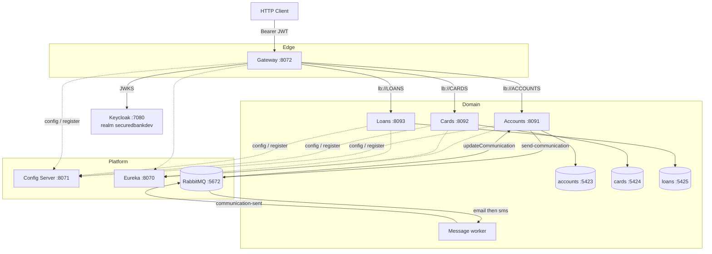
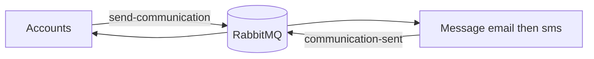

# SecuredBank Microservices


Domain-driven banking APIs (**Accounts**, **Cards**, **Loans**) behind a Keycloak-secured Gateway. Config and Eureka sit in the middle. Accounts publishes communication events to RabbitMQ; the **Message** worker sends email/SMS and Accounts marks `communication_sw`. Grafana, Loki, Alloy, Tempo, and MinIO handle telemetry.

Service docs: [accounts](accounts/README.md) · [cards](cards/README.md) · [loans](loans/README.md) · [message](message/README.md) · [gateway](gateway-server/README.md) · [keycloak](infra/README.md) · [observability](observability/README.md)

---

## Architecture



---

## Event-driven communication

On `POST /api/accounts/create`, Accounts publishes `AccountsMsgDto` to `send-communication`. Message runs composed function `email|sms` and publishes `accountNumber` to `communication-sent`. Accounts then sets `communication_sw = true`.



| Binding | Destination | Role |
| :--- | :--- | :--- |
| `sendCommunication-out-0` | `send-communication` | Accounts → Message |
| `emailsms-in-0` / `emailsms-out-0` | in / `communication-sent` | Message `email\|sms` |
| `updateCommunication-in-0` | `communication-sent` | Accounts consumer |

---

## Gateway security

OAuth2 resource server. JWT is validated against Keycloak JWKS (`http://localhost:7080/realms/securedbankdev/protocol/openid-connect/certs`). Realm roles `ACCOUNTS`, `CARDS`, `LOANS` become `ROLE_*`. CSRF is off. Realm and clients: [`infra/`](infra/README.md).

| Path | Rule |
| :--- | :--- |
| `GET /**` | Permit all |
| `/accounts/**`, `/ACCOUNTS/**` | `ROLE_ACCOUNTS` |
| `/cards/**`, `/CARDS/**` | `ROLE_CARDS` |
| `/loans/**`, `/LOANS/**` | `ROLE_LOANS` |

Path rewrite `(?i)/accounts\|cards\|loans/(.*)` → `/$1`, then `lb://` the matching service. Accounts has a circuit breaker + fallback; loans has a Redis rate limiter.

---

## Ports

| Component | Port | Notes |
| :--- | :--- | :--- |
| Gateway | `8072` | [routes](http://localhost:8072/actuator/gateway/routes) · [health](http://localhost:8072/actuator/health) |
| Accounts | `8091` | DB `5423` · [swagger](http://localhost:8091/swagger-ui/index.html) |
| Cards | `8092` | DB `5424` · [swagger](http://localhost:8092/swagger-ui/index.html) |
| Loans | `8093` | DB `5425` · [swagger](http://localhost:8093/swagger-ui/index.html) |
| Message | `9010` internal | Worker; no published HTTP port |
| Config Server | `8071` | [health](http://localhost:8071/actuator/health) |
| Eureka | `8070` | [dashboard](http://localhost:8070) |
| Keycloak | `7080` | [admin](http://localhost:7080) · realm `securedbankdev` |
| RabbitMQ | `5672` | UI [15672](http://localhost:15672) |
| Redis | `6379` | Gateway rate limiter |
| Grafana | `3000` | [UI](http://localhost:3000) |
| Tempo | `3110` | OTLP `4317` / `4318` |
| Loki gateway | `3100` | Read `3101` · Write `3102` |
| MinIO | `9000` / `9001` | Loki object store |
| Alloy | `12345` | Docker log collector |

---

## Local run

JDK 25, Docker, and Docker Compose.

```bash
make all-up              # full compose stack
make keycloak-up && make infra   # Keycloak + realm/roles (needed for mutating gateway calls)

make accounts-restart
make cards-restart
make loans-restart
make message-restart
make gateway-restart

make all-down
```

Gradle from each module: `./gradlew clean build` or `./gradlew bootRun`.

---

## Makefile (common)

| Target | Purpose |
| :--- | :--- |
| `all-up` / `all-down` | Start or tear down the compose stack |
| `accounts-restart` / `cards-restart` / `loans-restart` | Rebuild and recreate that API |
| `message-up` / `message-restart` / `message-down` | Message worker |
| `gateway-up` / `gateway-restart` / `gateway-down` | Gateway |
| `keycloak-up` / `infra` / `infra-down` / `keycloak-down` | Keycloak + OpenTofu realm |

---

## Observability

Alloy scrapes container stdout via `/var/run/docker.sock` and pushes to Loki (`tenant1`). Tempo receives OTLP traces from the Java agent. Grafana correlates logs and traces. Details: [observability/README.md](observability/README.md).

- Grafana Explore: [http://localhost:3000](http://localhost:3000)
- Metrics: `/actuator/prometheus` · traces: Tempo OTLP `4317`/`4318`
- LogQL example: `{container="accounts-api"} |= "ERROR"`
