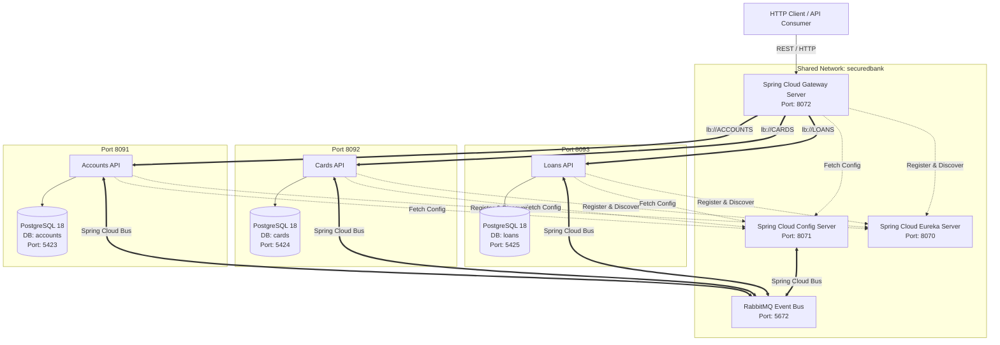

# SecuredBank Microservices Architecture


An enterprise-grade, domain-driven banking microservices platform built with **Spring Boot 4.1.0**, **Spring Cloud 2025.1.2**, and **Java 25**. The platform decouples core banking domains into standalone microservices (**Accounts**, **Cards**, **Loans**) accessible via an edge API Gateway ([**Gateway Server**](file:///Users/baicham/develop/java-projects/master-ms-sb/gateway-server)), backed by centralized configuration management ([**Config Server**](file:///Users/baicham/develop/java-projects/master-ms-sb/config-server)), service registration & discovery ([**Eureka Server**](file:///Users/baicham/develop/java-projects/master-ms-sb/eureka-server)), and dynamic event-driven refresh (**RabbitMQ** & **Spring Cloud Bus**).

---

## 🏛 Architecture Overview



---

<details open>
<summary><strong>🚀 Tech Stack</strong></summary>

| Component              | Technology                                         | Description                                                                                                                                     |
| :--------------------- | :------------------------------------------------- | :---------------------------------------------------------------------------------------------------------------------------------------------- |
| **Language**           | Java 25                                            | Latest Java Toolchain standard (`JavaLanguageVersion.of(25)`)                                                                                   |
| **Framework**          | Spring Boot 4.1.0                                  | Core microservice framework (Spring Web MVC, Data JPA, Actuator)                                                                                |
| **API Gateway**        | Spring Cloud Gateway WebFlux 2025.1.2              | Reactive edge routing & path rewriting ([`/gateway-server`](file:///Users/baicham/develop/java-projects/master-ms-sb/gateway-server))           |
| **Load Balancer**      | Spring Cloud LoadBalancer                          | Reactive client-side load balancing (`lb://ACCOUNTS`, `lb://CARDS`, `lb://LOANS`)                                                               |
| **Central Config**     | Spring Cloud Config 2025.1.2                       | Centralized configuration management ([`/config-server`](file:///Users/baicham/develop/java-projects/master-ms-sb/config-server))               |
| **Service Discovery**  | Spring Cloud Netflix Eureka                        | Service registration server & management dashboard ([`/eureka-server`](file:///Users/baicham/develop/java-projects/master-ms-sb/eureka-server)) |
| **Event Bus**          | Spring Cloud Bus AMQP                              | Event-driven dynamic configuration refresh via RabbitMQ (`/actuator/busrefresh`)                                                                |
| **Build Tool**         | Gradle                                             | Independent wrapper scripts (`./gradlew`) for each service                                                                                      |
| **Database**           | PostgreSQL 18 Alpine                               | Containerized relational database per microservice (`postgres:18-alpine`)                                                                       |
| **Database Migration** | Flyway (`org.flywaydb:flyway-database-postgresql`) | Versioned SQL database migrations (`db/migration/V1__init.sql`)                                                                                 |
| **API Documentation**  | SpringDoc OpenAPI 3.0 (`3.0.2`)                    | Automated Swagger UI (`/swagger-ui/index.html`) & OpenAPI specs                                                                                 |
| **Testing**            | Spring Boot Testcontainers                         | Ephemeral PostgreSQL containers (`@ServiceConnection`) for integration tests                                                                    |
| **Containerization**   | Docker & Docker Compose                            | Multi-stage container builds & unified orchestration (`securedbank` network)                                                                    |
| **Utilities**          | Project Lombok, Jakarta Validation                 | Boilerplate reduction & declarative bean validation (`@Valid`, `@Pattern`)                                                                      |

</details>

---

<details open>
<summary><strong>⚙️ Microservice Architecture & API Specs</strong></summary>

### Service Port & Infrastructure Allocation

| Microservice / Component | Path | Server Port | Database Name | Host DB Port | Swagger UI / Dashboard Endpoint | Actuator Health | Circuit Breaker Endpoint |
| :--- | :--- | :--- | :--- | :--- | :--- | :--- | :--- |
| **Gateway Server** | [`/gateway-server`](file:///Users/baicham/develop/java-projects/master-ms-sb/gateway-server) | `8072` | N/A | N/A | [http://localhost:8072/actuator/gateway/routes](http://localhost:8072/actuator/gateway/routes) | [http://localhost:8072/actuator/health](http://localhost:8072/actuator/health) | [http://localhost:8072/actuator/circuitbreakers](http://localhost:8072/actuator/circuitbreakers) |
| **Accounts** | [`/accounts`](file:///Users/baicham/develop/java-projects/master-ms-sb/accounts) | `8091` | `accounts` | `5423` | [http://localhost:8091/swagger-ui/index.html](http://localhost:8091/swagger-ui/index.html) | [http://localhost:8091/actuator/health](http://localhost:8091/actuator/health) | [http://localhost:8091/actuator/circuitbreakers](http://localhost:8091/actuator/circuitbreakers) |
| **Cards** | [`/cards`](file:///Users/baicham/develop/java-projects/master-ms-sb/cards) | `8092` | `cards` | `5424` | [http://localhost:8092/swagger-ui/index.html](http://localhost:8092/swagger-ui/index.html) | [http://localhost:8092/actuator/health](http://localhost:8092/actuator/health) | N/A |
| **Loans** | [`/loans`](file:///Users/baicham/develop/java-projects/master-ms-sb/loans) | `8093` | `loans` | `5425` | [http://localhost:8093/swagger-ui/index.html](http://localhost:8093/swagger-ui/index.html) | [http://localhost:8093/actuator/health](http://localhost:8093/actuator/health) | N/A |
| **Config Server** | [`/config-server`](file:///Users/baicham/develop/java-projects/master-ms-sb/config-server) | `8071` | N/A | N/A | N/A | [http://localhost:8071/actuator/health](http://localhost:8071/actuator/health) | N/A |
| **Eureka Server** | [`/eureka-server`](file:///Users/baicham/develop/java-projects/master-ms-sb/eureka-server) | `8070` | N/A | N/A | [http://localhost:8070](http://localhost:8070) | [http://localhost:8070/actuator/health](http://localhost:8070/actuator/health) | N/A |
| **RabbitMQ** | N/A | `5672` (Mgmt: `15672`) | N/A | N/A | N/A | N/A | N/A |

### 🛡️ Actuator & Circuit Breaker Monitoring Endpoints

| Service / Component | Feature / Metric | Actuator Monitoring Endpoint | Description |
| :--- | :--- | :--- | :--- |
| **Gateway Server** (`8072`) | Gateway Routes | [http://localhost:8072/actuator/gateway/routes](http://localhost:8072/actuator/gateway/routes) | List active gateway routes, predicates, and filters |
| **Gateway Server** (`8072`) | Circuit Breakers Status | [http://localhost:8072/actuator/circuitbreakers](http://localhost:8072/actuator/circuitbreakers) | State of Gateway circuit breakers (`accountsCircuitBreaker`, `cardsCircuitBreaker`, `loansCircuitBreaker`) |
| **Gateway Server** (`8072`) | Circuit Breaker Events | [http://localhost:8072/actuator/circuitbreakerevents](http://localhost:8072/actuator/circuitbreakerevents) | Event logs for state transitions, error rates, and fallbacks |
| **Gateway Server** (`8072`) | Health Indicator | [http://localhost:8072/actuator/health](http://localhost:8072/actuator/health) | Health status including Resilience4j health indicators |
| **Accounts Service** (`8091`) | Circuit Breakers Status | [http://localhost:8091/actuator/circuitbreakers](http://localhost:8091/actuator/circuitbreakers) | OpenFeign Resilience4j circuit breaker state (`cards`, `loans`) |
| **Accounts Service** (`8091`) | Circuit Breaker Events | [http://localhost:8091/actuator/circuitbreakerevents](http://localhost:8091/actuator/circuitbreakerevents) | Feign client fallback execution events |
| **Accounts Service** (`8091`) | Health Indicator | [http://localhost:8091/actuator/health](http://localhost:8091/actuator/health) | Comprehensive service and database health status |

---

<details>
<summary><strong>1. Spring Cloud Gateway Server</strong></summary>

- **Path**: [`/gateway-server`](file:///Users/baicham/develop/java-projects/master-ms-sb/gateway-server)
- **Port**: `8072`
- **Description**: Edge routing engine built on Spring Cloud Gateway WebFlux. Configured via Java `@Bean RouteLocator` with dynamic path rewriting, Resilience4j Circuit Breakers, and fallback handling.

#### Configured Gateway Routes & Fallback Rules

| Route ID | Matching Path Pattern | Rewrite Filter | Circuit Breaker & Fallback | Target Service URI | Sample API Gateway URL |
| :--- | :--- | :--- | :--- | :--- | :--- |
| `accounts-upper` | `/ACCOUNTS/**` | `/ACCOUNTS/(.*)` -> `/$1` | `accountsCircuitBreaker` (`forward:/accounts-fallback`) | `lb://ACCOUNTS` | `POST http://localhost:8072/ACCOUNTS/api/accounts/create` |
| `accounts-lower` | `/accounts/**` | `/accounts/(.*)` -> `/$1` | `accountsCircuitBreaker` (`forward:/accounts-fallback`) | `lb://ACCOUNTS` | `POST http://localhost:8072/accounts/api/accounts/create` |
| `cards-upper` | `/CARDS/**` | `/CARDS/(.*)` -> `/$1` | `cardsCircuitBreaker` (`forward:/cards-fallback`) | `lb://CARDS` | `POST http://localhost:8072/CARDS/api/cards/create` |
| `cards-lower` | `/cards/**` | `/cards/(.*)` -> `/$1` | `cardsCircuitBreaker` (`forward:/cards-fallback`) | `lb://CARDS` | `POST http://localhost:8072/cards/api/cards/create` |
| `loans-upper` | `/LOANS/**` | `/LOANS/(.*)` -> `/$1` | `loansCircuitBreaker` (`forward:/loans-fallback`) | `lb://LOANS` | `POST http://localhost:8072/LOANS/api/loans/create` |
| `loans-lower` | `/loans/**` | `/loans/(.*)` -> `/$1` | `loansCircuitBreaker` (`forward:/loans-fallback`) | `lb://LOANS` | `POST http://localhost:8072/loans/api/loans/create` |

</details>

---

<details>
<summary><strong>2. Accounts Microservice</strong></summary>

- **Path**: [`/accounts`](file:///Users/baicham/develop/java-projects/master-ms-sb/accounts)
- **Description**: Manages customer onboarding, profile metadata, and core bank account details.

#### Database Schema (`customer` & `accounts`)
- `customer`: `customer_id` (PK, Identity), `name`, `email`, `mobile_number`, audit fields (`created_at`, `created_by`, `updated_at`, `updated_by`).
- `accounts`: `account_number` (PK), `customer_id` (FK -> `customer.customer_id`), `account_type`, `branch_address`, audit fields.

#### REST API Endpoints

| Method   | Endpoint               | Description                       | Request Body / Params                   | Status Codes                              |
| :------- | :--------------------- | :-------------------------------- | :-------------------------------------- | :---------------------------------------- |
| `POST`   | `/api/accounts/create` | Create Customer & Account         | `CustomerDto` (JSON Body)               | `201 Created`, `500 Internal Error`       |
| `GET`    | `/api/accounts/fetch`  | Fetch Customer & Account Details  | `mobileNumber` (Query Param, 10 digits) | `200 OK`, `500 Internal Error`            |
| `PUT`    | `/api/accounts/update` | Update Customer & Account Details | `CustomerDto` (JSON Body)               | `200 OK`, `417 Expectation Failed`, `500` |
| `DELETE` | `/api/accounts/delete` | Delete Customer & Account Details | `mobileNumber` (Query Param, 10 digits) | `200 OK`, `417 Expectation Failed`, `500` |

</details>

---

<details>
<summary><strong>3. Cards Microservice</strong></summary>

- **Path**: [`/cards`](file:///Users/baicham/develop/java-projects/master-ms-sb/cards)
- **Description**: Manages credit and debit card issuance, limit tracking, and usage metrics per customer mobile number.

#### Database Schema (`cards`)
- `cards`: `card_id` (PK, Identity), `mobile_number`, `card_number` (Unique), `card_type`, `total_limit`, `amount_used`, `available_amount`, audit fields (`created_at`, `created_by`, `updated_at`, `updated_by`).

#### REST API Endpoints

| Method   | Endpoint            | Description         | Request Body / Params                   | Status Codes                              |
| :------- | :------------------ | :------------------ | :-------------------------------------- | :---------------------------------------- |
| `POST`   | `/api/cards/create` | Issue New Card      | `mobileNumber` (Query Param, 10 digits) | `201 Created`, `500 Internal Error`       |
| `GET`    | `/api/cards/fetch`  | Fetch Card Details  | `mobileNumber` (Query Param, 10 digits) | `200 OK`, `500 Internal Error`            |
| `PUT`    | `/api/cards/update` | Update Card Details | `CardsDto` (JSON Body)                  | `200 OK`, `417 Expectation Failed`, `500` |
| `DELETE` | `/api/cards/delete` | Delete Card Details | `mobileNumber` (Query Param, 10 digits) | `200 OK`, `417 Expectation Failed`, `500` |

</details>

---

<details>
<summary><strong>4. Loans Microservice</strong></summary>

- **Path**: [`/loans`](file:///Users/baicham/develop/java-projects/master-ms-sb/loans)
- **Description**: Manages customer loans (home, personal, vehicle), total loan amounts, repayments, and outstanding balances.

#### Database Schema (`loans`)
- `loans`: `loan_id` (PK, Identity), `mobile_number`, `loan_number`, `loan_type`, `total_loan`, `amount_paid`, `outstanding_amount`, audit fields (`created_at`, `created_by`, `updated_at`, `updated_by`).

#### REST API Endpoints

| Method   | Endpoint            | Description         | Request Body / Params                   | Status Codes                              |
| :------- | :------------------ | :------------------ | :-------------------------------------- | :---------------------------------------- |
| `POST`   | `/api/loans/create` | Create New Loan     | `mobileNumber` (Query Param, 10 digits) | `201 Created`, `500 Internal Error`       |
| `GET`    | `/api/loans/fetch`  | Fetch Loan Details  | `mobileNumber` (Query Param, 10 digits) | `200 OK`, `500 Internal Error`            |
| `PUT`    | `/api/loans/update` | Update Loan Details | `LoansDto` (JSON Body)                  | `200 OK`, `417 Expectation Failed`, `500` |
| `DELETE` | `/api/loans/delete` | Delete Loan Details | `mobileNumber` (Query Param, 10 digits) | `200 OK`, `417 Expectation Failed`, `500` |

</details>

---

<details>
<summary><strong>5. Spring Cloud Config Server</strong></summary>

- **Path**: [`/config-server`](file:///Users/baicham/develop/java-projects/master-ms-sb/config-server)
- **Description**: Centralized configuration management backed by Git repository ([`config-server-sb-sc-ms.git`](https://github.com/cham207388/config-server-sb-sc-ms.git)) exposing `/accounts/default`, `/cards/default`, and `/loans/default`.

</details>

---

<details>
<summary><strong>6. Spring Cloud Eureka Server</strong></summary>

- **Path**: [`/eureka-server`](file:///Users/baicham/develop/java-projects/master-ms-sb/eureka-server)
- **Description**: Centralized Netflix Eureka service discovery server providing microservice registration (`/eureka/apps/{APP_NAME}`) and web management dashboard at [http://localhost:8070](http://localhost:8070).

</details>

</details>

---

## 🛠 Local Development & Execution Guide

### Prerequisites
- **JDK 25** installed & configured in environment path.
- **Docker & Docker Compose** installed and running.
- **Gradle** (or use bundled `./gradlew` wrapper in each directory).

---

### 1. Provisioning Platform via Docker Compose

To launch the full architecture (Config Server, Eureka Server, Gateway Server, RabbitMQ, 3 Databases, and 3 Microservice APIs) on the shared `securedbank` network:

```bash
# Launch entire platform via Makefile
make all-up

# Or via Docker Compose directly
docker compose up -d

# Stop platform and clean volumes
make all-down
```

---

### 2. Building the Services

Compile and package services using the [`Makefile`](file:///Users/baicham/develop/java-projects/master-ms-sb/Makefile) or Gradle directly:

```bash
# Clean & build microservices via Makefile
make accounts-build
make cards-build
make loans-build
make eureka-server-build
make gateway-server-build

# Or build directly using the Gradle wrapper
cd accounts && ./gradlew clean build
cd ../cards && ./gradlew clean build
cd ../loans && ./gradlew clean build
cd ../config-server && ./gradlew clean build
cd ../eureka-server && ./gradlew clean build
cd ../gateway-server && ./gradlew clean build
```

---

### 3. Running Applications Locally (IDE / CLI)

Navigate into the respective service folder and launch via the Gradle wrapper:

```bash
# Launch Config Server (Port 8071)
cd config-server && ./gradlew bootRun

# Launch Eureka Server (Port 8070)
cd eureka-server && ./gradlew bootRun

# Launch Gateway Server (Port 8072)
cd gateway-server && ./gradlew bootRun

# Launch Accounts Service (Port 8091)
cd accounts && ./gradlew bootRun

# Launch Cards Service (Port 8092)
cd cards && ./gradlew bootRun

# Launch Loans Service (Port 8093)
cd loans && ./gradlew bootRun
```

---

## 📊 Environment Configuration & Overrides

Each microservice relies on configurable environment variables in its `application.yaml` file:

| Environment Variable  | Description             | Accounts Default                | Cards Default                   | Loans Default                   | Config Server Default | Eureka Server Default           | Gateway Server Default          |
| :-------------------- | :---------------------- | :------------------------------ | :------------------------------ | :------------------------------ | :-------------------- | :------------------------------ | :------------------------------ |
| `DB_HOST`             | Database Hostname       | `localhost`                     | `localhost`                     | `localhost`                     | N/A                   | N/A                             | N/A                             |
| `DB_PORT`             | PostgreSQL Host Port    | `5423`                          | `5424`                          | `5425`                          | N/A                   | N/A                             | N/A                             |
| `DB_NAME`             | PostgreSQL DB Name      | `accounts`                      | `cards`                         | `loans`                         | N/A                   | N/A                             | N/A                             |
| `DB_USERNAME`         | Database User           | `postgres`                      | `postgres`                      | `postgres`                      | N/A                   | N/A                             | N/A                             |
| `DB_PASSWORD`         | Database Password       | `postgres`                      | `postgres`                      | `postgres`                      | N/A                   | N/A                             | N/A                             |
| `CONFIG_SERVER_URL`   | Config Server Endpoint  | `http://localhost:8071/`        | `http://localhost:8071/`        | `http://localhost:8071/`        | N/A                   | `http://localhost:8071/`        | `http://localhost:8071/`        |
| `EUREKA_DEFAULT_ZONE` | Eureka Default Zone URL | `http://localhost:8070/eureka/` | `http://localhost:8070/eureka/` | `http://localhost:8070/eureka/` | N/A                   | `http://localhost:8070/eureka/` | `http://localhost:8070/eureka/` |
| `RABBITMQ_HOST`       | RabbitMQ Broker Host    | `localhost`                     | `localhost`                     | `localhost`                     | `localhost`           | N/A                             | N/A                             |
| `RABBITMQ_PORT`       | RabbitMQ AMQP Port      | `5672`                          | `5672`                          | `5672`                          | `5672`                | N/A                             | N/A                             |

### 🌐 Docker Container Networking & Eureka Status Links Note
When microservices run inside Docker Desktop (macOS/Windows), their internal container IP addresses (e.g. `172.19.x.x`) are isolated within Docker's Linux VM network bridge. 

To ensure status page links clicked on the Eureka Dashboard ([http://localhost:8070](http://localhost:8070)) load correctly in host browsers while maintaining inter-container discovery, each microservice defines:
```yaml
eureka:
  instance:
    prefer-ip-address: true
    status-page-url: ${EUREKA_INSTANCE_STATUS_PAGE_URL:http://localhost:${server.port}/actuator/info}
    health-check-url: ${EUREKA_INSTANCE_HEALTH_CHECK_URL:http://localhost:${server.port}/actuator/health}
```
This routes host browser link navigation through published host ports (`8091`, `8092`, `8093`, `8072`) while inter-service communication remains containerized.

---

## 🐳 Docker & Multi-Stage Containerization

Each service includes a multi-stage `Dockerfile` optimized for security and minimal image size:

1. **Stage 1 (`build`)**: Uses `eclipse-temurin:25-jdk-alpine` to compile and package the Spring Boot executable JAR.
2. **Stage 2 (`runtime`)**: Uses `eclipse-temurin:25-jre-alpine`, configures a non-root system user (`producer:producer` / `gateway:gateway`), copies the built JAR, and exposes the respective port.

The consolidated root [`compose.yml`](file:///Users/baicham/develop/java-projects/master-ms-sb/compose.yml) connects all services on a shared bridge network (`securedbank`) with memory resource limits set to 700MB per container.

---

## 📄 Build & Management Commands ([`Makefile`](file:///Users/baicham/develop/java-projects/master-ms-sb/Makefile))

| Makefile Target        | Command Executed                                                                    | Purpose                                   |
| :--------------------- | :---------------------------------------------------------------------------------- | :---------------------------------------- |
| `all-up`               | `docker compose up -d`                                                              | Launches entire platform stack            |
| `all-down`             | `docker compose down -v`                                                            | Stops platform stack & cleans volumes     |
| `gateway-server-build` | `cd gateway-server && ./gradlew clean build`                                        | Cleans & compiles Gateway Server          |
| `gateway-up`           | `docker compose up gateway-server -d --build --no-deps`                             | Starts Gateway Server container           |
| `gateway-down`         | `docker compose stop gateway-server`                                                | Stops Gateway Server container            |
| `accounts-build`       | `cd accounts && ./gradlew clean build`                                              | Cleans & compiles Accounts service        |
| `accounts-db-up`       | `cd accounts && docker compose up accounts-db -d`                                   | Starts Accounts PostgreSQL database       |
| `accounts-db-down`     | `docker compose -f accounts/compose.yml down accounts-db -v`                        | Stops Accounts DB & removes volumes       |
| `accounts-api-run`     | `docker compose -f accounts/compose.yml up accounts-api -d --build`                 | Rebuilds & starts Accounts API container  |
| `accounts`             | `docker compose -f accounts/compose.yml up -d`                                      | Starts Accounts DB & API stack            |
| `accounts-down`        | `docker compose -f accounts/compose.yml down -d`                                    | Stops Accounts DB & API stack             |
| `cards-build`          | `cd cards && ./gradlew clean build`                                                 | Cleans & compiles Cards service           |
| `cards-db-up`          | `cd cards && docker compose up cards-db -d`                                         | Starts Cards PostgreSQL database          |
| `cards-db-down`        | `docker compose -f cards/compose.yml down cards-db -v`                              | Stops Cards DB & removes volumes          |
| `cards-api-run`        | `docker compose -f cards/compose.yml up cards-api -d`                               | Starts Cards API container                |
| `cards`                | `docker compose -f cards/compose.yml up -d`                                         | Starts Cards DB & API stack               |
| `cards-down`           | `docker compose -f cards/compose.yml down -d`                                       | Stops Cards DB & API stack                |
| `loans-build`          | `cd loans && ./gradlew clean build`                                                 | Cleans & compiles Loans service           |
| `loans-db-up`          | `cd loans && docker compose up loans-db -d`                                         | Starts Loans PostgreSQL database          |
| `loans-db-down`        | `docker compose -f loans/compose.yml down loans-db -v`                              | Stops Loans DB & removes volumes          |
| `loans-api`            | `docker compose -f loans/compose.yml up loans-api -d`                               | Starts Loans API container                |
| `loans`                | `docker compose -f loans/compose.yml up -d`                                         | Starts Loans DB & API stack               |
| `loans-down`           | `docker compose -f loans/compose.yml down -d`                                       | Stops Loans DB & API stack                |
| `rabbit-mq-up`         | `docker compose -f ../master-ms-sb-config-server/compose.yml up rabbit-mq -d`       | Starts standalone RabbitMQ container      |
| `rabbit-mq-down`       | `docker compose -f ../master-ms-sb-config-server/compose.yml down rabbit-mq -v`     | Stops RabbitMQ container & cleans volumes |
| `config-server-up`     | `docker compose -f ../master-ms-sb-config-server/compose.yml up config-server -d`   | Starts Config Server container            |
| `config-server-down`   | `docker compose -f ../master-ms-sb-config-server/compose.yml down config-server -v` | Stops Config Server container             |
| `config-all-up`        | `docker compose -f ../master-ms-sb-config-server/compose.yml up -d`                 | Starts Config Server & RabbitMQ stack     |
| `config-all-down`      | `docker compose -f ../master-ms-sb-config-server/compose.yml down -v`               | Stops Config Server & RabbitMQ stack      |
| `dbs-down`             | `accounts-db-down cards-db-down loans-db-down`                                      | Stops all databases and cleans volumes    |
