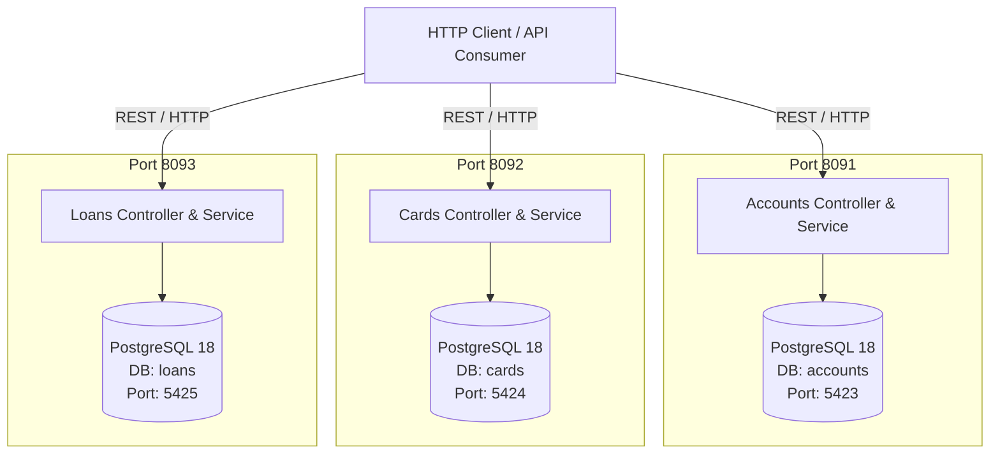

# EazyBank Microservices Architecture


An enterprise-grade, domain-driven banking microservices application built with **Spring Boot 4.1.0** and **Java 25**. The platform decouples core banking domains into standalone, independently deployable microservices for managing **Accounts**, **Cards**, and **Loans**.

---

## 🏛 Architecture Overview



---

<details open>
<summary><strong>🚀 Tech Stack</strong></summary>

| Component | Technology | Description |
| :--- | :--- | :--- |
| **Language** | Java 25 | Latest Java Toolchain standard (`JavaLanguageVersion.of(25)`) |
| **Framework** | Spring Boot 4.1.0 | Core microservice framework (Spring Web MVC, Data JPA, Actuator) |
| **Dependency Management** | Spring Dependency Management 1.1.7 | Version management plugin for Spring Boot dependencies |
| **Build Tool** | Gradle | Independent wrapper scripts (`./gradlew`) for each service |
| **Database** | PostgreSQL 18 Alpine | Containerized relational database per microservice (`postgres:18-alpine`) |
| **Database Migration**| Flyway (`org.flywaydb:flyway-database-postgresql`) | Versioned SQL database migrations (`db/migration/V1__init.sql`) |
| **API Documentation**| SpringDoc OpenAPI 3.0 (`3.0.2`) | Automated Swagger UI (`/swagger-ui.html`) & OpenAPI documentation |
| **Containerization** | Docker & Docker Compose | Multi-stage container builds & per-service orchestration (`compose.yml`) |
| **Utilities** | Project Lombok, Jakarta Validation | Boilerplate reduction & declarative bean validation (`@Valid`, `@Pattern`) |

</details>

---

<details open>
<summary><strong>⚙️ Microservice Architecture & API Specs</strong></summary>

### Service Port & Database Allocation

| Microservice | Server Port | Database Name | Host DB Port | Swagger UI Endpoint | Actuator Health |
| :--- | :--- | :--- | :--- | :--- | :--- |
| **Accounts** | `8091` | `accounts` | `5423` | [http://localhost:8091/swagger-ui.html](http://localhost:8091/swagger-ui.html) | [http://localhost:8091/actuator](http://localhost:8091/actuator) |
| **Cards** | `8092` | `cards` | `5424` | [http://localhost:8092/swagger-ui.html](http://localhost:8092/swagger-ui.html) | [http://localhost:8092/actuator](http://localhost:8092/actuator) |
| **Loans** | `8093` | `loans` | `5425` | [http://localhost:8093/swagger-ui.html](http://localhost:8093/swagger-ui.html) | [http://localhost:8093/actuator](http://localhost:8093/actuator) |

---

<details>
<summary><strong>1. Accounts Microservice</strong></summary>

- **Path**: [`/accounts`](file:///Users/baicham/develop/java-projects/master-ms-sb/accounts)
- **Description**: Manages customer onboarding, profile metadata, and core bank account details.

#### Database Schema (`customer` & `accounts`)
- `customer`: `customer_id` (PK, Identity), `name`, `email`, `mobile_number`, audit fields (`created_at`, `created_by`, `updated_at`, `updated_by`).
- `accounts`: `account_number` (PK), `customer_id` (FK -> `customer.customer_id`), `account_type`, `branch_address`, audit fields.

#### REST API Endpoints

| Method | Endpoint | Description | Request Body / Params | Status Codes |
| :--- | :--- | :--- | :--- | :--- |
| `POST` | `/api/create` | Create Customer & Account | `CustomerDto` (JSON Body) | `201 Created`, `500 Internal Error` |
| `GET` | `/api/fetch` | Fetch Customer & Account Details | `mobileNumber` (Query Param, 10 digits) | `200 OK`, `500 Internal Error` |
| `PUT` | `/api/update` | Update Customer & Account Details | `CustomerDto` (JSON Body) | `200 OK`, `417 Expectation Failed`, `500` |
| `DELETE`| `/api/delete` | Delete Customer & Account Details | `mobileNumber` (Query Param, 10 digits) | `200 OK`, `417 Expectation Failed`, `500` |

</details>

---

<details>
<summary><strong>2. Cards Microservice</strong></summary>

- **Path**: [`/cards`](file:///Users/baicham/develop/java-projects/master-ms-sb/cards)
- **Description**: Manages credit and debit card issuance, limit tracking, and usage metrics per customer mobile number.

#### Database Schema (`cards`)
- `cards`: `card_id` (PK, Identity), `mobile_number`, `card_number` (Unique), `card_type`, `total_limit`, `amount_used`, `available_amount`, audit fields (`created_at`, `created_by`, `updated_at`, `updated_by`).

#### REST API Endpoints

| Method | Endpoint | Description | Request Body / Params | Status Codes |
| :--- | :--- | :--- | :--- | :--- |
| `POST` | `/api/create` | Issue New Card | `mobileNumber` (Query Param, 10 digits) | `201 Created`, `500 Internal Error` |
| `GET` | `/api/fetch` | Fetch Card Details | `mobileNumber` (Query Param, 10 digits) | `200 OK`, `500 Internal Error` |
| `PUT` | `/api/update` | Update Card Details | `CardsDto` (JSON Body) | `200 OK`, `417 Expectation Failed`, `500` |
| `DELETE`| `/api/delete` | Delete Card Details | `mobileNumber` (Query Param, 10 digits) | `200 OK`, `417 Expectation Failed`, `500` |

</details>

---

<details>
<summary><strong>3. Loans Microservice</strong></summary>

- **Path**: [`/loans`](file:///Users/baicham/develop/java-projects/master-ms-sb/loans)
- **Description**: Manages customer loans (home, personal, vehicle), total loan amounts, repayments, and outstanding balances.

#### Database Schema (`loans`)
- `loans`: `loan_id` (PK, Identity), `mobile_number`, `loan_number`, `loan_type`, `total_loan`, `amount_paid`, `outstanding_amount`, audit fields (`created_at`, `created_by`, `updated_at`, `updated_by`).

#### REST API Endpoints

| Method | Endpoint | Description | Request Body / Params | Status Codes |
| :--- | :--- | :--- | :--- | :--- |
| `POST` | `/api/create` | Create New Loan | `mobileNumber` (Query Param, 10 digits) | `201 Created`, `500 Internal Error` |
| `GET` | `/api/fetch` | Fetch Loan Details | `mobileNumber` (Query Param, 10 digits) | `200 OK`, `500 Internal Error` |
| `PUT` | `/api/update` | Update Loan Details | `LoansDto` (JSON Body) | `200 OK`, `417 Expectation Failed`, `500` |
| `DELETE`| `/api/delete` | Delete Loan Details | `mobileNumber` (Query Param, 10 digits) | `200 OK`, `417 Expectation Failed`, `500` |

</details>

</details>

---

## 🛠 Local Development & Execution Guide

### Prerequisites
- **JDK 25** installed & configured in environment path.
- **Docker & Docker Compose** installed and running.
- **Gradle** (or use bundled `./gradlew` wrapper in each microservice directory).

---

### 1. Database & Infrastructure Provisioning

Each microservice contains a dedicated `compose.yml` file to launch its PostgreSQL database and API container. You can use the project [`Makefile`](file:///Users/baicham/develop/java-projects/master-ms-sb/Makefile) targets to bring up services:

```bash
# Launch database containers individually
make accounts-db-up
make cards-db-up
make loans-db-up

# Or bring up complete service stacks (DB + API)
make accounts
make cards
make loans

# Stop all database containers and remove persistent volumes
make dbs-down
```

---

### 2. Building the Microservices

Compile and package individual services using the [`Makefile`](file:///Users/baicham/develop/java-projects/master-ms-sb/Makefile) or Gradle directly:

```bash
# Clean & build microservices via Makefile
make accounts-build
make cards-build
make loans-build

# Or build directly using the Gradle wrapper
cd accounts && ./gradlew clean build
cd ../cards && ./gradlew clean build
cd ../loans && ./gradlew clean build
```

---

### 3. Running the Applications

Navigate into the respective microservice folder and launch via the Gradle wrapper:

```bash
# Launch Accounts Service (Port 8091)
cd accounts && ./gradlew bootRun

# Launch Cards Service (Port 8092)
cd cards && ./gradlew bootRun

# Launch Loans Service (Port 8093)
cd loans && ./gradlew bootRun
```

---

## 📊 Environment Configuration & Overrides

Each microservice relies on configurable environment variables in its `application.yaml` file:

| Environment Variable | Description | Accounts Default | Cards Default | Loans Default |
| :--- | :--- | :--- | :--- | :--- |
| `DB_HOST` | Database Hostname / Service Name | `localhost` | `localhost` | `localhost` |
| `DB_PORT` | PostgreSQL Host Port | `5423` | `5424` | `5425` |
| `DB_NAME` | PostgreSQL Database Name | `accounts` | `cards` | `loans` |
| `DB_USERNAME` | Database User | `postgres` | `postgres` | `postgres` |
| `DB_PASSWORD` | Database Password | `postgres` | `postgres` | `postgres` |

---

## 🐳 Docker & Multi-Stage Containerization

Each microservice includes a multi-stage `Dockerfile` optimized for security and minimal image size:

1. **Stage 1 (`build`)**: Uses `eclipse-temurin:25-jdk-alpine` to compile and package the Spring Boot executable JAR.
2. **Stage 2 (`runtime`)**: Uses `eclipse-temurin:25-jre-alpine`, configures a non-root system user (`producer:producer`), copies the built JAR, and exposes the respective service port (`8091`, `8092`, or `8093`).

---

## 📄 Build & Management Commands ([`Makefile`](file:///Users/baicham/develop/java-projects/master-ms-sb/Makefile))

| Makefile Target | Command Executed | Purpose |
| :--- | :--- | :--- |
| `accounts-build` | `cd accounts && ./gradlew clean build` | Cleans & compiles Accounts service |
| `accounts-db-up` | `cd accounts && docker compose up accounts-db -d` | Starts Accounts PostgreSQL database |
| `accounts-db-down` | `docker compose -f accounts/compose.yml down accounts-db -v` | Stops Accounts DB & removes volumes |
| `accounts-api-run` | `docker compose -f accounts/compose.yml up accounts-api -d` | Starts Accounts API container |
| `accounts` | `docker compose -f accounts/compose.yml up -d` | Starts Accounts DB & API stack |
| `cards-build` | `cd cards && ./gradlew clean build` | Cleans & compiles Cards service |
| `cards-db-up` | `cd cards && docker compose up cards-db -d` | Starts Cards PostgreSQL database |
| `cards-db-down` | `docker compose -f cards/compose.yml down cards-db -v` | Stops Cards DB & removes volumes |
| `cards-api-run` | `docker compose -f cards/compose.yml up cards-api -d` | Starts Cards API container |
| `cards` | `docker compose -f cards/compose.yml up -d` | Starts Cards DB & API stack |
| `loans-build` | `cd loans && ./gradlew clean build` | Cleans & compiles Loans service |
| `loans-db-up` | `cd loans && docker compose up loans-db -d` | Starts Loans PostgreSQL database |
| `loans-db-down` | `docker compose -f loans/compose.yml down loans-db -v` | Stops Loans DB & removes volumes |
| `loans-api` | `docker compose -f loans/compose.yml up loans-api -d` | Starts Loans API container |
| `loans` | `docker compose -f loans/compose.yml up -d` | Starts Loans DB & API stack |
| `dbs-down` | `accounts-db-down cards-db-down loans-db-down` | Stops all databases and cleans volumes |


