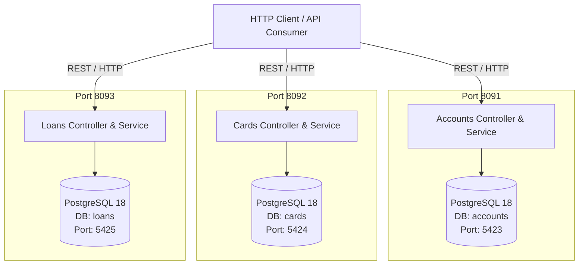

# EazyBank Microservices Architecture


An enterprise-grade, domain-driven banking microservices application built with **Spring Boot 4.1.0** and **Java 25**. The platform decouples core banking domains into standalone, independently deployable microservices for managing **Accounts**, **Cards**, and **Loans**.

---

## 🏛 Architecture Overview



---

<details open>
<summary><strong>🚀 Tech Stack</strong></summary>

| Component | Technology | Description |
| :--- | :--- | :--- |
| **Language** | Java 25 | Latest Java Toolchain standard (`JavaLanguageVersion.of(25)`) |
| **Framework** | Spring Boot 4.1.0 | Core microservice framework (Spring MVC, Data JPA, Actuator) |
| **Build Tool** | Gradle | Independent wrapper scripts (`./gradlew`) for each service |
| **Database** | PostgreSQL 18 Alpine | Containerized relational database per microservice |
| **Database Migration**| Flyway (`1.1.7` integration) | Versioned SQL database migrations (`db/migration/V1__init.sql`) |
| **API Documentation**| SpringDoc OpenAPI 3.0 (`3.0.2`)| Automated Swagger UI & OpenAPI documentation |
| **Containerization** | Docker Compose | Local container orchestration & `spring-boot-docker-compose` dev support |
| **Utilities** | Project Lombok, Jakarta Validation | Boilerplate reduction & declarative bean validation |

</details>

---

<details open>
<summary><strong>⚙️ Microservice Architecture & API Specs</strong></summary>

### Service Port & Database Allocation

| Microservice | Server Port | Database Name | Host DB Port | Swagger UI Endpoint | Actuator Health |
| :--- | :--- | :--- | :--- | :--- | :--- |
| **Accounts** | `8091` | `accounts` | `5423` | `http://localhost:8091/swagger-ui.html` | `http://localhost:8091/actuator` |
| **Cards** | `8092` | `cards` | `5424` | `http://localhost:8092/swagger-ui.html` | `http://localhost:8092/actuator` |
| **Loans** | `8093` | `loans` | `5425` | `http://localhost:8093/swagger-ui.html` | `http://localhost:8093/actuator` |

---

<details>
<summary><strong>1. Accounts Microservice</strong></summary>

- **Path**: [`/accounts`](file:///Users/baicham/develop/java-projects/master-ms-sb/accounts)
- **Description**: Manages customer onboarding, profile metadata, and core bank account details.

#### Database Schema (`customer` & `accounts`)
- `customer`: `customer_id` (PK), `name`, `email`, `mobile_number`, audit fields (`created_at`, `created_by`, `updated_at`, `updated_by`).
- `accounts`: `account_number` (PK), `customer_id` (FK), `account_type`, `branch_address`, audit fields.

#### REST API Endpoints

| Method | Endpoint | Description | Request Body / Params | Status Codes |
| :--- | :--- | :--- | :--- | :--- |
| `POST` | `/api/create` | Create Customer & Account | `CustomerDto` (JSON) | `201 Created`, `500 Internal Error` |
| `GET` | `/api/fetch` | Fetch Customer & Account Details | `mobileNumber` (Query Param, 10 digits) | `200 OK`, `500 Internal Error` |
| `PUT` | `/api/update` | Update Customer & Account Details | `CustomerDto` (JSON) | `200 OK`, `417 Expectation Failed`, `500` |
| `DELETE`| `/api/delete` | Delete Customer & Account Details | `mobileNumber` (Query Param, 10 digits) | `200 OK`, `417 Expectation Failed`, `500` |

</details>

---

<details>
<summary><strong>2. Cards Microservice</strong></summary>

- **Path**: [`/cards`](file:///Users/baicham/develop/java-projects/master-ms-sb/cards)
- **Description**: Manages credit and debit card issuance, limit tracking, and usage metrics per customer mobile number.

#### Database Schema (`cards`)
- `cards`: `card_id` (PK), `mobile_number`, `card_number` (Unique), `card_type`, `total_limit`, `amount_used`, `available_amount`, audit fields.

#### REST API Endpoints

| Method | Endpoint | Description | Request Body / Params | Status Codes |
| :--- | :--- | :--- | :--- | :--- |
| `POST` | `/api/create` | Issue New Card | `mobileNumber` (Query Param, 10 digits) | `201 Created`, `500 Internal Error` |
| `GET` | `/api/fetch` | Fetch Card Details | `mobileNumber` (Query Param, 10 digits) | `200 OK`, `500 Internal Error` |
| `PUT` | `/api/update` | Update Card Details | `CardsDto` (JSON) | `200 OK`, `417 Expectation Failed`, `500` |
| `DELETE`| `/api/delete` | Delete Card Details | `mobileNumber` (Query Param, 10 digits) | `200 OK`, `417 Expectation Failed`, `500` |

</details>

---

<details>
<summary><strong>3. Loans Microservice</strong></summary>

- **Path**: [`/loans`](file:///Users/baicham/develop/java-projects/master-ms-sb/loans)
- **Description**: Manages customer loans (home, personal, vehicle), total loan amounts, repayments, and outstanding balances.

#### Database Schema (`loans`)
- `loans`: `loan_id` (PK), `mobile_number`, `loan_number`, `loan_type`, `total_loan`, `amount_paid`, `outstanding_amount`, audit fields.

#### REST API Endpoints

| Method | Endpoint | Description | Request Body / Params | Status Codes |
| :--- | :--- | :--- | :--- | :--- |
| `POST` | `/api/create` | Create New Loan | `mobileNumber` (Query Param, 10 digits) | `201 Created`, `500 Internal Error` |
| `GET` | `/api/fetch` | Fetch Loan Details | `mobileNumber` (Query Param, 10 digits) | `200 OK`, `500 Internal Error` |
| `PUT` | `/api/update` | Update Loan Details | `LoansDto` (JSON) | `200 OK`, `417 Expectation Failed`, `500` |
| `DELETE`| `/api/delete` | Delete Loan Details | `mobileNumber` (Query Param, 10 digits) | `200 OK`, `417 Expectation Failed`, `500` |

</details>

</details>

---

## 🛠 Local Development & Execution Guide

### Prerequisites
- **JDK 25** installed & configured.
- **Docker & Docker Compose** installed and running.
- **Gradle** (or use bundled `./gradlew`).

### 1. Database & Infrastructure Provisioning

Each microservice contains a dedicated `compose.yml` to launch its required PostgreSQL database instance. You can start all databases using the project [`Makefile`](file:///Users/baicham/develop/java-projects/master-ms-sb/Makefile):

```bash
# Start all containerized databases
make compose-up

# Stop all databases and remove persistent volumes
make compose-down
```

 Alternatively, Spring Boot DevTools automatically integrates with Docker Compose via `spring-boot-docker-compose` to spin up databases on application startup.

---

### 2. Building the Microservices

You can build individual services or use the root Makefile:

```bash
# Build Accounts microservice (skipping tests)
make build-account

# Build Cards microservice (skipping tests)
make build-cards

# Or build via Gradle directly
cd accounts && ./gradlew build
cd ../cards && ./gradlew build
cd ../loans && ./gradlew build
```

---

### 3. Running the Applications

Navigate into the respective microservice folder and launch via Gradle:

```bash
# Launch Accounts Service (Port 8091)
cd accounts && ./gradlew bootRun

# Launch Cards Service (Port 8092)
cd cards && ./gradlew bootRun

# Launch Loans Service (Port 8093)
cd loans && ./gradlew bootRun
```

---

## 📊 Environment Configuration & Overrides

Each microservice leverages standard environment variable overrides in `application.yaml`:

| Environment Variable | Description | Default (Accounts) | Default (Cards) | Default (Loans) |
| :--- | :--- | :--- | :--- | :--- |
| `DB_URL` | PostgreSQL JDBC Connection String | `jdbc:postgresql://localhost:5423/accounts` | `jdbc:postgresql://localhost:5424/cards` | `jdbc:postgresql://localhost:5425/loans` |
| `DB_USERNAME` | Database User | `postgres` | `postgres` | `postgres` |
| `DB_PASSWORD` | Database Password | `postgres` | `postgres` | `postgres` |

---

## 📄 Build & Management Commands (`Makefile`)

| Makefile Target | Command Executed | Purpose |
| :--- | :--- | :--- |
| `compose-up` | `docker compose up -d` | Starts database infrastructure in detached mode |
| `compose-down` | `docker compose down -v` | Stops infrastructure and cleans volumes |
| `build-account` | `cd accounts && ./gradlew build -x test` | Compiles & packages Accounts service |
| `build-cards` | `cd cards && ./gradlew build -x test` | Compiles & packages Cards service |
| `accounts-schema`| `psql -U postgres -d microservice -p 5423 -f ...` | Manually applies SQL schema for accounts |
| `cards-schema` | `psql -U postgres -d microservice -p 5423 -f ...` | Manually applies SQL schema for cards |

