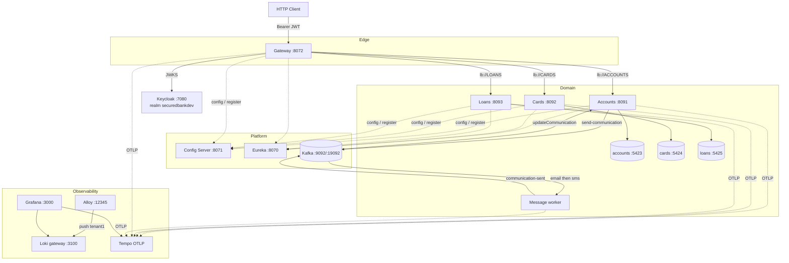
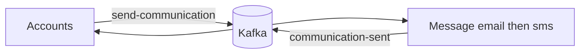

# SecuredBank Microservices Architecture


Domain-driven banking platform on **Spring Boot 4.1.0**, **Spring Cloud 2025.1.2**, and **Java 25**. Domain APIs (**Accounts**, **Cards**, **Loans**) sit behind a Keycloak-secured Gateway. Config Server and Eureka handle config and discovery. Accounts publishes communication events over **Apache Kafka**; the **Message** worker sends email/SMS and Accounts marks `communication_sw`. Grafana, Loki, Alloy, Tempo, and MinIO cover telemetry.

Service docs: [accounts](accounts/README.md) · [cards](cards/README.md) · [loans](loans/README.md) · [message](message/README.md) · [gateway](gateway-server/README.md) · [config](config-server/README.md) · [eureka](eureka-server/README.md) · [keycloak](infra/README.md) · [observability](observability/README.md)

---

## Architecture



---

## Event-driven communication

On `POST /api/accounts/create`, Accounts publishes `AccountsMsgDto` to `send-communication`. Message runs composed function `email|sms` and publishes `accountNumber` to `communication-sent`. Accounts then sets `communication_sw = true`.



| Binding | Destination | Role |
| :--- | :--- | :--- |
| `sendCommunication-out-0` | `send-communication` | Accounts → Message |
| `emailsms-in-0` / `emailsms-out-0` | in / `communication-sent` | Message `email\|sms` |
| `updateCommunication-in-0` | `communication-sent` | Accounts consumer |

---

## Gateway security

OAuth2 resource server. JWT is validated against Keycloak JWKS (`http://localhost:7080/realms/securedbankdev/protocol/openid-connect/certs`). Realm roles `ACCOUNTS`, `CARDS`, `LOANS` become `ROLE_*`. CSRF is off. Realm and clients: [`infra/`](infra/README.md).

| Path | Rule |
| :--- | :--- |
| `GET /**` | Permit all |
| `/accounts/**`, `/ACCOUNTS/**` | `ROLE_ACCOUNTS` |
| `/cards/**`, `/CARDS/**` | `ROLE_CARDS` |
| `/loans/**`, `/LOANS/**` | `ROLE_LOANS` |

Path rewrite `(?i)/accounts|cards|loans/(.*)` → `/$1`, then `lb://` the matching service. Accounts has a circuit breaker + fallback; loans has a Redis rate limiter.

---

<details open>
<summary><strong>Tech Stack</strong></summary>

| Component | Technology | Description |
| :--- | :--- | :--- |
| **Language** | Java 25 | Toolchain (`JavaLanguageVersion.of(25)`) |
| **Framework** | Spring Boot 4.1.0 | Web MVC, Data JPA, Actuator |
| **API Gateway** | Spring Cloud Gateway WebFlux | Reactive edge routing ([`gateway-server`](gateway-server)) |
| **Security** | Keycloak + OAuth2 Resource Server | JWT JWKS validation; realm roles `ACCOUNTS` / `CARDS` / `LOANS` |
| **Load Balancer** | Spring Cloud LoadBalancer | `lb://ACCOUNTS`, `lb://CARDS`, `lb://LOANS` |
| **Central Config** | Spring Cloud Config | ([`config-server`](config-server)) |
| **Service Discovery** | Netflix Eureka | ([`eureka-server`](eureka-server)) |
| **Messaging** | Spring Cloud Stream + Apache Kafka | Accounts ↔ Message (`send-communication` / `communication-sent`) |
| **Observability UI** | Grafana 11.5.2 | Dashboards; Loki datasource `tenant1` |
| **Log Engine** | Grafana Loki 3.4.2 | `read`, `write`, `backend` targets |
| **Log Collector** | Grafana Alloy v1.7.1 | Harvests Docker logs via `/var/run/docker.sock` |
| **Tracing** | Tempo 2.9.0 / OpenTelemetry Agent | OTLP `4317` gRPC / `4318` HTTP |
| **Object Storage** | MinIO | S3 backend for Loki chunks |
| **Loki Edge Proxy** | Nginx 1.27.4-alpine | Push → write; query → read |
| **Build** | Gradle | Per-service `./gradlew` |
| **Database** | PostgreSQL 18 Alpine | One DB per domain service |
| **Migrations** | Flyway | `db/migration/V*.sql` |
| **API Docs** | SpringDoc OpenAPI 3.0.2 | `/swagger-ui/index.html` |
| **Testing** | Testcontainers | `@ServiceConnection` PostgreSQL |
| **Containers** | Docker Compose | Root [`compose.yml`](compose.yml) with `include:` |

</details>

---

<details open>
<summary><strong>Infrastructure, Ports & Endpoints</strong></summary>

| Component | Path | Port | DB / Host Port | UI / Docs | Health / Status |
| :--- | :--- | :--- | :--- | :--- | :--- |
| **Gateway** | [`gateway-server`](gateway-server) | `8072` | — | [routes](http://localhost:8072/actuator/gateway/routes) | [health](http://localhost:8072/actuator/health) · [CBs](http://localhost:8072/actuator/circuitbreakers) |
| **Accounts** | [`accounts`](accounts) | `8091` | `accounts` / `5423` | [swagger](http://localhost:8091/swagger-ui/index.html) | [health](http://localhost:8091/actuator/health) · [CBs](http://localhost:8091/actuator/circuitbreakers) |
| **Cards** | [`cards`](cards) | `8092` | `cards` / `5424` | [swagger](http://localhost:8092/swagger-ui/index.html) | [health](http://localhost:8092/actuator/health) |
| **Loans** | [`loans`](loans) | `8093` | `loans` / `5425` | [swagger](http://localhost:8093/swagger-ui/index.html) | [health](http://localhost:8093/actuator/health) |
| **Message** | [`message`](message) | `9010` internal | — | Worker (no published HTTP) | — |
| **Config Server** | [`config-server`](config-server) | `8071` | — | — | [health](http://localhost:8071/actuator/health) |
| **Eureka** | [`eureka-server`](eureka-server) | `8070` | — | [dashboard](http://localhost:8070) | [health](http://localhost:8070/actuator/health) |
| **Keycloak** | [`infra`](infra) | `7080` | — | [admin](http://localhost:7080) · realm `securedbankdev` | — |
| **Kafka** | [`docker-compose.event.yml`](docker-compose.event.yml) | `9092` host / `19092` Docker | — | Broker for Accounts ↔ Message | — |
| **Redis** | — | `6379` | — | Gateway rate limiter | — |
| **Grafana** | [`observability/grafana`](observability/grafana) | `3000` | — | [UI](http://localhost:3000) | [api/health](http://localhost:3000/api/health) |
| **Tempo** | [`observability/tempo`](observability/tempo) | `3110` | OTLP `4317`/`4318` | — | — |
| **Loki gateway** | [`observability/loki`](observability/loki) | `3100` | Read `3101` · Write `3102` | [3100](http://localhost:3100) | [read ready](http://localhost:3101/ready) · [write ready](http://localhost:3102/ready) |
| **MinIO** | — | `9000` / `9001` | — | [console](http://localhost:9001) | [live](http://localhost:9000/minio/health/live) |
| **Alloy** | [`observability/alloy`](observability/alloy) | `12345` | — | [UI](http://localhost:12345) | — |

</details>

---

## Observability & log telemetry

```
[ Docker Socket /var/run/docker.sock ]
            │
            ▼ harvest stdout/stderr
[ Grafana Alloy :12345 ]
            │
            ▼ HTTP push / tenant1
[ Loki Nginx Gateway :3100 ]
       ├──► Write :3102 ──► MinIO (loki-data, loki-ruler)
       └──► Read  :3101 ◄── MinIO
            ▲
            │ LogQL
[ Grafana :3000 ]
```

**Alloy** mounts `/var/run/docker.sock`, labels streams with `container` (e.g. `accounts-api`), and pushes to Loki with `X-Scope-OrgID: tenant1`.

**Loki** uses separate read / write / backend targets. **Tempo** receives OTLP from the OpenTelemetry Java agent (`JAVA_TOOL_OPTIONS` in `common-docker-config.yml`, `OTEL_EXPORTER_OTLP_ENDPOINT: http://tempo:4317`). Set `OTEL_SERVICE_NAME` per service (`accounts`, `cards`, `loans`, `message`, `gateway-server`, …).

### LogQL examples

```logql
{container="accounts-api"}
{container="accounts-api"} |= "ERROR"
{container="gateway-server"} | json | level="error"
{container="accounts-api"} != "/actuator/health"
sum by (container) (rate({container=~".+"}[1m]))
```

Full detail: [observability/README.md](observability/README.md).

---

## Local development

**Prerequisites:** JDK 25, Docker & Docker Compose.

```bash
# Full stack (includes Message + Kafka + observability)
make all-up
# or: docker compose up -d

# Keycloak + realm/roles (needed for mutating gateway calls)
make keycloak-up && make infra

# Observability only
docker compose -f docker-compose-observability.yml up -d

# Rebuild / recreate a service
make accounts-restart
make cards-restart
make loans-restart
make message-restart
make gateway-restart

make all-down
```

### Build

```bash
make accounts-build
make cards-build
make loans-build
make message-build
make eureka-server-build
make gateway-server-build
# or: cd <service> && ./gradlew clean build
```

### Boot locally

```bash
cd config-server && ./gradlew bootRun   # 8071
cd eureka-server && ./gradlew bootRun   # 8070
cd gateway-server && ./gradlew bootRun  # 8072
cd accounts && ./gradlew bootRun        # 8091
cd cards && ./gradlew bootRun           # 8092
cd loans && ./gradlew bootRun           # 8093
cd message && ./gradlew bootRun         # 9010 (worker)
```

---

## Environment overrides

| Variable | Description | Typical defaults |
| :--- | :--- | :--- |
| `SPRING_DATASOURCE_URL` | JDBC URL | Accounts `…:5423/accounts` · Cards `…:5424/cards` · Loans `…:5425/loans` |
| `SPRING_DATASOURCE_USERNAME` / `PASSWORD` | DB credentials | `postgres` / `postgres` |
| `SPRING_CONFIG_IMPORT` | Config Server | `optional:configserver:http://localhost:8071/` |
| `EUREKA_CLIENT_SERVICEURL_DEFAULTZONE` | Eureka zone | `http://localhost:8070/eureka/` |
| `KAFKA_BROKER` | Kafka bootstrap | `localhost:9092` (in Compose: `kafka:19092`) |
| `SPRING_DATA_REDIS_HOST` / `PORT` | Gateway rate limiter | `localhost` / `6379` |
| `KEYCLOAK_JWK_SET_URI` | Gateway JWT JWKS | `http://localhost:7080/realms/securedbankdev/protocol/openid-connect/certs` |

---

## Makefile ([`Makefile`](Makefile))

| Target | Purpose |
| :--- | :--- |
| `all-up` / `all-down` | Start or tear down the compose stack |
| `accounts` / `cards` / `loans` | Start DB + API for that service |
| `accounts-restart` / `cards-restart` / `loans-restart` | Rebuild and recreate that API |
| `accounts-build` / `cards-build` / `loans-build` / `message-build` | Gradle `clean build` |
| `message-up` / `message-restart` / `message-down` | Message worker |
| `gateway-up` / `gateway-restart` / `gateway-down` | Gateway |
| `eureka-server-up` / `eureka-server-down` | Eureka |
| `kafka-up` / `kafka-down` | Apache Kafka broker |
| `dbs-up` / `dbs-down` | All databases |
| `keycloak-up` / `infra` / `infra-down` / `keycloak-down` | Keycloak + OpenTofu realm |
| `images-build` / `images-push` / `images-build-push` | Hub images (APIs, message, gateway, config, eureka) |
| `watch` / `watch-accounts` / `watch-message` / … | Compose watch |

---

## Observability resources

- Metrics: `/actuator/metrics`, `/actuator/prometheus` — [Micrometer](https://micrometer.io/) · [Prometheus](https://prometheus.io/)
- Logs: [Loki](https://grafana.com/docs/loki/latest/) via Alloy
- Traces: [Tempo](https://grafana.com/docs/tempo/latest/) · [OpenTelemetry](https://opentelemetry.io/)
- UI: [Grafana](https://grafana.com/) at [http://localhost:3000](http://localhost:3000)

## References

- [Spring Boot Application Properties](https://docs.spring.io/spring-boot/appendix/application-properties/index.html)
- [Apache Kafka](https://kafka.apache.org/)
  - [Getting started with Docker](https://kafka.apache.org/43/getting-started/docker/)
  - [Kafka on Docker (Confluent tutorial)](https://developer.confluent.io/confluent-tutorials/kafka-on-docker/)
- [kubernetes](https://kubernetes.io/)
  - [dashboard](https://kubernetes.io/docs/tasks/access-application-cluster/web-ui-dashboard/)
  - [helm](https://helm.sh/)