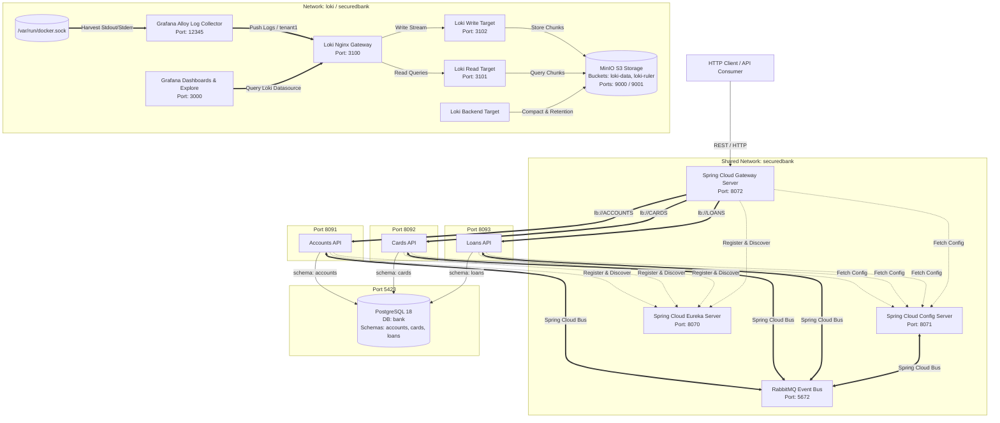

# SecuredBank Microservices Architecture


An enterprise-grade, domain-driven banking microservices platform built with **Spring Boot 4.1.0**, **Spring Cloud 2025.1.2**, and **Java 25**. The platform decouples core banking domains into standalone microservices (**Accounts**, **Cards**, **Loans**) accessible via an edge API Gateway ([**Gateway Server**](file:///Users/baicham/develop/java-projects/master-ms-sb/gateway-server)), backed by centralized configuration management ([**Config Server**](file:///Users/baicham/develop/java-projects/master-ms-sb/config-server)), service registration & discovery ([**Eureka Server**](file:///Users/baicham/develop/java-projects/master-ms-sb/eureka-server)), dynamic event-driven refresh (**RabbitMQ** & **Spring Cloud Bus**), and a full observability stack (**Grafana**, **Loki**, **Grafana Alloy**, and **MinIO**).

---

## 🏛 Architecture Overview



---

<details open>
<summary><strong>🚀 Tech Stack</strong></summary>

| Component              | Technology                                         | Description                                                                                                                                     |
| :--------------------- | :------------------------------------------------- | :---------------------------------------------------------------------------------------------------------------------------------------------- |
| **Language**           | Java 25                                            | Latest Java Toolchain standard (`JavaLanguageVersion.of(25)`)                                                                                   |
| **Framework**          | Spring Boot 4.1.0                                  | Core microservice framework (Spring Web MVC, Data JPA, Actuator)                                                                                |
| **API Gateway**        | Spring Cloud Gateway WebFlux 2025.1.2              | Reactive edge routing & path rewriting ([`/gateway-server`](file:///Users/baicham/develop/java-projects/master-ms-sb/gateway-server))           |
| **Load Balancer**      | Spring Cloud LoadBalancer                          | Reactive client-side load balancing (`lb://ACCOUNTS`, `lb://CARDS`, `lb://LOANS`)                                                               |
| **Central Config**     | Spring Cloud Config 2025.1.2                       | Centralized configuration management ([`/config-server`](file:///Users/baicham/develop/java-projects/master-ms-sb/config-server))               |
| **Service Discovery**  | Spring Cloud Netflix Eureka                        | Service registration server & management dashboard ([`/eureka-server`](file:///Users/baicham/develop/java-projects/master-ms-sb/eureka-server)) |
| **Event Bus**          | Spring Cloud Bus AMQP                              | Event-driven dynamic configuration refresh via RabbitMQ (`/actuator/busrefresh`)                                                                |
| **Observability UI**   | Grafana 11.5.2                                     | Telemetry dashboard & log analytics UI with pre-configured Loki datasource (`tenant1`)                                                          |
| **Log Storage Engine** | Grafana Loki 3.4.2                                 | Microservices decoupled log engine (`read`, `write`, `backend` targets)                                                                         |
| **Log Collector**     | Grafana Alloy v1.7.1                               | Next-gen OpenTelemetry & Prometheus telemetry collector harvesting Docker logs via `/var/run/docker.sock`                                      |
| **Distributed Tracing** | Grafana Tempo 2.9.0 / OpenTelemetry Agent          | OTLP tracing collector (`4317` gRPC / `4318` HTTP) with automatic JVM bytecode instrumentation                                                 |
| **Object Storage**     | MinIO (RELEASE.2024-12-18)                         | High-performance S3-compatible object storage backing Loki index & chunk storage                                                               |
| **Loki Edge Proxy**    | Nginx 1.27.4-alpine                                | Reverse proxy routing push requests to `write` target and query requests to `read` target                                                        |
| **Build Tool**         | Gradle                                             | Independent wrapper scripts (`./gradlew`) for each service                                                                                      |
| **Database**           | PostgreSQL 18 Alpine                               | Containerized relational database per microservice (`postgres:18-alpine`)                                                                       |
| **Database Migration** | Flyway (`org.flywaydb:flyway-database-postgresql`) | Versioned SQL database migrations (`db/migration/V1__init.sql`)                                                                                 |
| **API Documentation**  | SpringDoc OpenAPI 3.0 (`3.0.2`)                    | Automated Swagger UI (`/swagger-ui/index.html`) & OpenAPI specs                                                                                 |
| **Testing**            | Spring Boot Testcontainers                         | Ephemeral PostgreSQL containers (`@ServiceConnection`) for integration tests                                                                    |
| **Containerization**   | Docker & Docker Compose                            | Multi-stage container builds & unified modular orchestration (`compose.yml` with `include:`)                                                   |

</details>

---

<details open>
<summary><strong>⚙️ Infrastructure, Ports & API Allocation</strong></summary>

### Service Port & Infrastructure Allocation

| Microservice / Component | Path | Server Port | Database Name | Host DB Port | Dashboard / UI Endpoint | Actuator Health | Circuit Breaker / Status Endpoint |
| :--- | :--- | :--- | :--- | :--- | :--- | :--- | :--- |
| **Gateway Server** | [`/gateway-server`](file:///Users/baicham/develop/java-projects/master-ms-sb/gateway-server) | `8072` | N/A | N/A | [http://localhost:8072/actuator/gateway/routes](http://localhost:8072/actuator/gateway/routes) | [http://localhost:8072/actuator/health](http://localhost:8072/actuator/health) | [http://localhost:8072/actuator/circuitbreakers](http://localhost:8072/actuator/circuitbreakers) |
| **Accounts** | [`/accounts`](file:///Users/baicham/develop/java-projects/master-ms-sb/accounts) | `8091` | `bank` (schema: `accounts`) | `5423` | [http://localhost:8091/swagger-ui/index.html](http://localhost:8091/swagger-ui/index.html) | [http://localhost:8091/actuator/health](http://localhost:8091/actuator/health) | [http://localhost:8091/actuator/circuitbreakers](http://localhost:8091/actuator/circuitbreakers) |
| **Cards** | [`/cards`](file:///Users/baicham/develop/java-projects/master-ms-sb/cards) | `8092` | `bank` (schema: `cards`) | `5423` | [http://localhost:8092/swagger-ui/index.html](http://localhost:8092/swagger-ui/index.html) | [http://localhost:8092/actuator/health](http://localhost:8092/actuator/health) | N/A |
| **Loans** | [`/loans`](file:///Users/baicham/develop/java-projects/master-ms-sb/loans) | `8093` | `bank` (schema: `loans`) | `5423` | [http://localhost:8093/swagger-ui/index.html](http://localhost:8093/swagger-ui/index.html) | [http://localhost:8093/actuator/health](http://localhost:8093/actuator/health) | N/A |
| **Shared Bank DB** | [`docker-compose.db.yml`](file:///Users/baicham/develop/java-projects/master-ms-sb/docker-compose.db.yml) | N/A | `bank` | `5423` | N/A | N/A | N/A |
| **Config Server** | [`/config-server`](file:///Users/baicham/develop/java-projects/master-ms-sb/config-server) | `8071` | N/A | N/A | N/A | [http://localhost:8071/actuator/health](http://localhost:8071/actuator/health) | N/A |
| **Eureka Server** | [`/eureka-server`](file:///Users/baicham/develop/java-projects/master-ms-sb/eureka-server) | `8070` | N/A | N/A | [http://localhost:8070](http://localhost:8070) | [http://localhost:8070/actuator/health](http://localhost:8070/actuator/health) | N/A |
| **RabbitMQ** | N/A | `5672` (Mgmt: `15672`) | N/A | N/A | [http://localhost:15672](http://localhost:15672) | N/A | N/A |
| **Grafana UI** | [`/observability/grafana`](file:///Users/baicham/develop/java-projects/master-ms-sb/observability/grafana) | `3000` | N/A | N/A | [http://localhost:3000](http://localhost:3000) | [http://localhost:3000/api/health](http://localhost:3000/api/health) | N/A |
| **Grafana Tempo** | [`/observability/tempo`](file:///Users/baicham/develop/java-projects/master-ms-sb/observability/tempo) | `3110` (OTLP: `4317`/`4318`) | N/A | N/A | N/A | N/A | N/A |
| **Loki Gateway** | [`/observability/loki`](file:///Users/baicham/develop/java-projects/master-ms-sb/observability/loki) | `3100` | N/A | N/A | [http://localhost:3100](http://localhost:3100) | N/A | N/A |
| **Loki Read Target** | N/A | `3101` | N/A | N/A | N/A | [http://localhost:3101/ready](http://localhost:3101/ready) | N/A |
| **Loki Write Target** | N/A | `3102` | N/A | N/A | N/A | [http://localhost:3102/ready](http://localhost:3102/ready) | N/A |
| **MinIO Console** | N/A | `9001` (API: `9000`) | N/A | N/A | [http://localhost:9001](http://localhost:9001) | [http://localhost:9000/minio/health/live](http://localhost:9000/minio/health/live) | N/A |
| **Grafana Alloy** | [`/observability/alloy`](file:///Users/baicham/develop/java-projects/master-ms-sb/observability/alloy) | `12345` | N/A | N/A | [http://localhost:12345](http://localhost:12345) | N/A | N/A |

</details>

---

## 🔭 Observability & Log Telemetry Architecture

The platform features an automated, zero-code-change log telemetry pipeline powered by **Grafana Alloy**, **Grafana Loki**, and **Grafana**:

```
[ Docker Socket /var/run/docker.sock ] 
            │
            ▼ (Harvest stdout/stderr logs)
[ Grafana Alloy Collector (Port 12345) ]
            │
            ▼ (HTTP Push / tenant1)
[ Loki Nginx Gateway (Port 3100) ]
       ├───► Write Target (Port 3102) ───► MinIO S3 (Buckets: loki-data, loki-ruler)
       └───► Read Target (Port 3101)  ◄─── MinIO S3
            ▲
            │ (LogQL Query)
[ Grafana UI (Port 3000) ]
```

### 1. How Log Collection Works (Grafana Alloy)
- **Zero Instrument overhead**: Microservices don't need dedicated log appenders. Alloy mounts `/var/run/docker.sock` to discover every running container.
- **Relabeling Rules**: Alloy extracts the raw Docker container name (e.g., `accounts-api`, `cards-api`, `gateway-server`) and attaches it as a searchable stream label `container`.
- **Multi-Tenant Push**: Alloy pushes collected log streams to `http://gateway:3100/loki/api/v1/push` tagged with header `X-Scope-OrgID: tenant1`.

### 2. Loki Decoupled Microservices Architecture
- **Read Target (`grafana/loki:3.4.2`)**: Dedicated query processing engine listening on port `3101`.
- **Write Target (`grafana/loki:3.4.2`)**: High-throughput log ingestion engine listening on port `3102`.
- **Backend Target (`grafana/loki:3.4.2`)**: Compactor, retention enforcer, and ruler manager.
- **MinIO Object Store**: S3-compatible backend hosting index files (`index_*`) and compressed log chunks (`loki-data`).

### 3. Distributed Tracing Pipeline (OpenTelemetry & Grafana Tempo)
- **Automatic JVM Bytecode Instrumentation**: Each Spring Boot container image downloads the OpenTelemetry Java Agent at build time:
  ```dockerfile
  ADD https://github.com/open-telemetry/opentelemetry-java-instrumentation/releases/download/v2.30.0/opentelemetry-javaagent.jar /app/libs/opentelemetry-javaagent.jar
  ```
- **JVM Configuration**: Configured centrally in `common-docker-config.yml`:
  ```yaml
  JAVA_TOOL_OPTIONS: "-javaagent:/app/libs/opentelemetry-javaagent.jar"
  OTEL_EXPORTER_OTLP_ENDPOINT: http://tempo:4317
  ```
- **Service Name Identification**: Each service specifies `OTEL_SERVICE_NAME` in its compose environment (`accounts`, `cards`, `loans`, `gateway-server`, `eureka-server`, `config-server`).
- **Grafana & Loki Correlation**: Grafana Tempo (`http://tempo:3100`, OTLP ports `4317` gRPC / `4318` HTTP) receives trace spans and correlates them with Loki log streams via `TraceID` derived fields.

### 4. LogQL Learning & Query Guide
When accessing Grafana at **http://localhost:3000**, navigate to **Explore** and select the **Loki** or **Tempo** datasource.

#### Essential LogQL Examples:
- **Stream all logs for a specific microservice**:
  ```logql
  {container="accounts-api"}
  ```
- **Filter logs containing explicit errors**:
  ```logql
  {container="accounts-api"} |= "ERROR"
  ```
- **Filter and parse JSON log payloads**:
  ```logql
  {container="gateway-server"} | json | level="error"
  ```
- **Exclude noise (e.g., actuator health checks)**:
  ```logql
  {container="accounts-api"} != "/actuator/health"
  ```
- **Calculate log entry rate per minute across services**:
  ```logql
  sum by (container) (rate({container=~".+"}[1m]))
  ```

---

## 🛠 Local Development & Execution Guide

### Prerequisites
- **JDK 25** installed & configured in environment path.
- **Docker & Docker Compose** installed and running.
- **Gradle** (or use bundled `./gradlew` wrapper in each directory).

---

### 1. Provisioning Platform via Docker Compose

To launch the full architecture (Config Server, Eureka Server, Gateway Server, RabbitMQ, Databases, Microservice APIs, Loki, MinIO, Alloy, Grafana) on the network stack:

```bash
# Launch entire platform via Makefile (Includes Observability)
make all-up

# Or via Docker Compose directly
docker compose up -d

# Provision standalone Observability stack only
docker compose -f docker-compose-observability.yml up -d

# Stop platform and clean volumes
make all-down
```

---

### 2. Building the Services

Compile and package services using the [`Makefile`](file:///Users/baicham/develop/java-projects/master-ms-sb/Makefile) or Gradle directly:

```bash
# Clean & build microservices via Makefile
make accounts-build
make cards-build
make loans-build
make eureka-server-build
make gateway-server-build

# Or build directly using the Gradle wrapper
cd accounts && ./gradlew clean build
cd ../cards && ./gradlew clean build
cd ../loans && ./gradlew clean build
cd ../config-server && ./gradlew clean build
cd ../eureka-server && ./gradlew clean build
cd ../gateway-server && ./gradlew clean build
```

---

### 3. Running Applications Locally (IDE / CLI)

Navigate into the respective service folder and launch via the Gradle wrapper:

```bash
# Launch Config Server (Port 8071)
cd config-server && ./gradlew bootRun

# Launch Eureka Server (Port 8070)
cd eureka-server && ./gradlew bootRun

# Launch Gateway Server (Port 8072)
cd gateway-server && ./gradlew bootRun

# Launch Accounts Service (Port 8091)
cd accounts && ./gradlew bootRun

# Launch Cards Service (Port 8092)
cd cards && ./gradlew bootRun

# Launch Loans Service (Port 8093)
cd loans && ./gradlew bootRun
```

---

## 📊 Environment Configuration & Overrides

Each microservice relies on configurable environment variables in its `application.yaml` file:

| Environment Variable                   | Description                    | Accounts Default                | Cards Default                   | Loans Default                   | Config Server Default | Eureka Server Default           | Gateway Server Default          |
| :------------------------------------- | :----------------------------- | :------------------------------ | :------------------------------ | :------------------------------ | :-------------------- | :------------------------------ | :------------------------------ |
| `SPRING_DATASOURCE_URL`                | Database JDBC URL              | `jdbc:postgresql://...:5423/bank?currentSchema=accounts` | `jdbc:postgresql://...:5423/bank?currentSchema=cards` | `jdbc:postgresql://...:5423/bank?currentSchema=loans` | N/A                   | N/A                             | N/A                             |
| `SPRING_DATASOURCE_USERNAME`           | Database User                  | `postgres`                      | `postgres`                      | `postgres`                      | N/A                   | N/A                             | N/A                             |
| `SPRING_DATASOURCE_PASSWORD`           | Database Password              | `postgres`                      | `postgres`                      | `postgres`                      | N/A                   | N/A                             | N/A                             |
| `SPRING_CONFIG_IMPORT`                 | Config Server Import           | `optional:configserver:http://` | `optional:configserver:http://` | `optional:configserver:http://` | N/A                   | `configserver:http://...`       | `optional:configserver:http://` |
| `EUREKA_CLIENT_SERVICEURL_DEFAULTZONE` | Eureka Default Zone URL        | `http://localhost:8070/eureka/` | `http://localhost:8070/eureka/` | `http://localhost:8070/eureka/` | N/A                   | `http://localhost:8070/eureka/` | `http://localhost:8070/eureka/` |
| `SPRING_DATA_REDIS_HOST`               | Redis Server Host              | N/A                             | N/A                             | N/A                             | N/A                   | N/A                             | `localhost`                     |
| `SPRING_DATA_REDIS_PORT`               | Redis Server Port              | N/A                             | N/A                             | N/A                             | N/A                   | N/A                             | `6379`                          |
| `SPRING_RABBITMQ_HOST`                 | RabbitMQ Broker Host           | `localhost`                     | `localhost`                     | `localhost`                     | `localhost`           | N/A                             | N/A                             |
| `SPRING_RABBITMQ_PORT`                 | RabbitMQ AMQP Port             | `5672`                          | `5672`                          | `5672`                          | `5672`                | N/A                             | N/A                             |

---

## 📄 Build & Management Commands ([`Makefile`](file:///Users/baicham/develop/java-projects/master-ms-sb/Makefile))

| Makefile Target        | Command Executed                                                                    | Purpose                                   |
| :--------------------- | :---------------------------------------------------------------------------------- | :---------------------------------------- |
| `all-up`               | `docker compose up -d`                                                              | Launches entire platform stack            |
| `all-down`             | `docker compose down -v`                                                            | Stops platform stack & cleans volumes     |
| `gateway-server-build` | `cd gateway-server && ./gradlew clean build`                                        | Cleans & compiles Gateway Server          |
| `gateway-up`           | `docker compose up gateway-server -d --build --no-deps`                             | Starts Gateway Server container           |
| `gateway-down`         | `docker compose stop gateway-server`                                                | Stops Gateway Server container            |
| `accounts-build`       | `cd accounts && ./gradlew clean build`                                              | Cleans & compiles Accounts service        |
| `accounts-db-up`       | `docker compose up bank-db -d`                                                      | Starts Shared PostgreSQL database         |
| `accounts-db-down`     | `@echo (notice)`                                                                    | Notice: use `make dbs-down`               |
| `accounts-api-run`     | `docker compose up accounts-api -d --build --no-deps`                               | Rebuilds & starts Accounts API container  |
| `accounts`             | `docker compose up bank-db accounts-api -d`                                         | Starts Shared DB & Accounts API stack     |
| `accounts-down`        | `docker compose stop accounts-api && docker compose rm -f accounts-api`             | Stops Accounts API container              |
| `cards-build`          | `cd cards && ./gradlew clean build`                                                 | Cleans & compiles Cards service           |
| `cards-db-up`          | `docker compose up bank-db -d`                                                      | Starts Shared PostgreSQL database         |
| `cards-db-down`        | `@echo (notice)`                                                                    | Notice: use `make dbs-down`               |
| `cards-api-run`        | `docker compose up cards-api -d --build --no-deps`                                  | Starts Cards API container                |
| `cards`                | `docker compose up bank-db cards-api -d`                                            | Starts Shared DB & Cards API stack        |
| `cards-down`           | `docker compose stop cards-api && docker compose rm -f cards-api`                   | Stops Cards API container                 |
| `loans-build`          | `cd loans && ./gradlew clean build`                                                 | Cleans & compiles Loans service           |
| `loans-db-up`          | `docker compose up bank-db -d`                                                      | Starts Shared PostgreSQL database         |
| `loans-db-down`        | `@echo (notice)`                                                                    | Notice: use `make dbs-down`               |
| `loans-api`            | `docker compose up loans-api -d --build --no-deps`                                  | Starts Loans API container                |
| `loans`                | `docker compose up bank-db loans-api -d`                                            | Starts Shared DB & Loans API stack        |
| `loans-down`           | `docker compose stop loans-api && docker compose rm -f loans-api`                   | Stops Loans API container                 |
| `bank-db-up`           | `docker compose up bank-db -d`                                                      | Starts Shared PostgreSQL database         |
| `bank-db-down`         | `docker compose down bank-db -v`                                                    | Stops Shared DB & removes volume          |
| `dbs-down`             | `docker compose down bank-db -v`                                                    | Stops Shared DB and cleans volume         |


## Observability Resources

For full details on the observability and monitoring platform architecture, data flow, component breakdown, and quickstart commands, see the dedicated [Observability README](file:///Users/baicham/develop/java-projects/master-ms-sb/observability/README.md).

### Micrometer

Spring Boot Actuator provides a MicrometerFacade for Spring Boot applications to integrate with Micrometer.
For Java application to expose metrics 

- [micrometer](https://micrometer.io/)

**Path**

- `service-name/actuator/metrics`

### Prometheus

Collects metrics from individual services and stores them in a single location

- [prometheus](https://prometheus.io/)

**Path**

- `service-name/actuator/prometheus`

### Grafana

Provides a visualization layer on top of Prometheus, Loki, and Tempo.

- [grafana](https://grafana.com/)

### Loki

Collects logs from individual services and stores them in a single location

- [loki](https://grafana.com/docs/loki/latest/)

### Tempo

Collects traces from individual services and stores them in a single location

- [tempo](https://grafana.com/docs/tempo/latest/)

### OpenTelemetry

OpenTelemetry is a set of APIs, SDKs, and tools used to generate, collect, and export telemetry data (metrics, logs, and traces) from applications.

- [OpenTelemetry](https://opentelemetry.io/)

