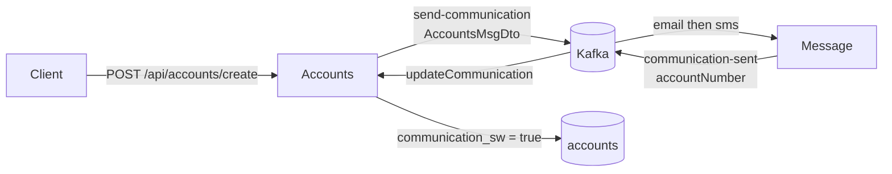

# Accounts Microservice


Customer onboarding and account lifecycle for SecuredBank. After create, Accounts publishes a communication event; Message sends email/SMS and Accounts marks the account notified.

---

## Specifications

- **Port**: `8091` · **DB**: PostgreSQL 18 on `5423` (`accounts`)
- **Swagger**: [http://localhost:8091/swagger-ui/index.html](http://localhost:8091/swagger-ui/index.html)
- **Health**: [http://localhost:8091/actuator/health](http://localhost:8091/actuator/health)

**Schema**
- `customer`: `customer_id`, `name`, `email`, `mobile_number`, audit fields
- `accounts`: `account_number`, `customer_id`, `account_type`, `branch_address`, `communication_sw`, audit fields

---

## Event-driven communication

Create publishes `AccountsMsgDto` (`accountNumber`, `name`, `email`, `mobileNumber`) to Kafka. Message consumes it, then Accounts sets `communication_sw = true`.



| Binding | Direction | Destination | Function |
| :--- | :--- | :--- | :--- |
| `sendCommunication-out-0` | out | `send-communication` | `StreamBridge` after create |
| `updateCommunication-in-0` | in (`group: accounts`) | `communication-sent` | `Consumer<Long>` |

---

## REST API

| Method | Endpoint | Description |
| :--- | :--- | :--- |
| `POST` | `/api/accounts/create` | Onboard customer, open account, publish event |
| `GET` | `/api/accounts/fetch` | Fetch by `mobileNumber` |
| `PUT` | `/api/accounts/update` | Update customer and account |
| `DELETE` | `/api/accounts/delete` | Delete by `mobileNumber` |
| `GET` | `/api/accounts/customers/fetchCustomerDetails` | Aggregate customer, cards, and loans |

---

## Local run

Requires Kafka (`make kafka-up` or full stack). Compose sets `KAFKA_BROKER=kafka:19092`; local `bootRun` defaults to `localhost:9092`.

```bash
./gradlew clean build
make accounts-restart   # rebuild and recreate accounts-api
```

### Kubernetes (kind)

Manifests: [`k8s/`](k8s/) (`db.yml`, `deployment.yml`, `service.yml`, `networkpolicy.yml`). From repo root: `make k8s-accounts`. See [docs/kubernetes.md](../docs/kubernetes.md).
