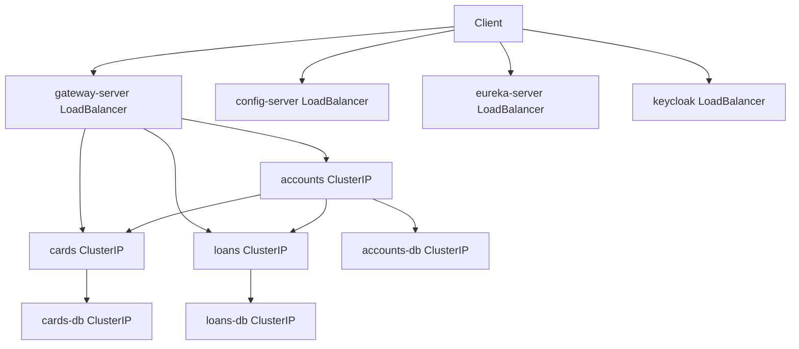

# Kubernetes (kind)

Local orchestration for SecuredBank on [kind](https://kind.sigs.k8s.io/). Platform resources live under [`kubernetes/`](../kubernetes/); each microservice keeps split manifests in `<service>/k8s/`.

## Layout

| Path | Role |
| :--- | :--- |
| [`kubernetes/1_keycloak.yml`](../kubernetes/1_keycloak.yml) | Keycloak Deployment + Postgres StatefulSet + Secret + Services |
| [`kubernetes/2_configmap.yml`](../kubernetes/2_configmap.yml) | Shared `securedbank-configmap` (Config, Eureka, Kafka, Redis, Keycloak JWKS) |
| [`kubernetes/3_*.yml` … `10_message.yml`](../kubernetes/) | Monolithic copies (learning / alternate apply path); **do not delete** |
| [`kubernetes/9_kafka.yml`](../kubernetes/9_kafka.yml) | Single-node KRaft Kafka (`kafka:19092`) |
| `accounts/k8s/`, `cards/k8s/`, `loans/k8s/` | `db.yml`, `deployment.yml`, `service.yml` (ClusterIP), `networkpolicy.yml` |
| `message/k8s/` | `deployment.yml`, `service.yml` (ClusterIP worker; Kafka via ConfigMap) |
| `config-server/k8s/`, `eureka-server/k8s/`, `gateway-server/k8s/` | `deployment.yml`, `service.yml` (LoadBalancer) |

Postgres 18 volumes mount at **`/var/lib/postgresql`** (same as Compose). Do not mount at `/var/lib/postgresql/data`.

## Network architecture

Edge services stay reachable from the host via LoadBalancer (+ `cloud-provider-kind`). Domain APIs and databases are ClusterIP-only; ingress is restricted with NetworkPolicies.



| Tier | Service type | Who may reach it |
| :--- | :--- | :--- |
| Keycloak, config-server, eureka-server, gateway-server | LoadBalancer | Host / clients (learning access) |
| accounts | ClusterIP | `gateway-server` only (`:8091`) |
| cards / loans | ClusterIP | `gateway-server` **or** `accounts` (Feign for `fetchCustomerDetails`) |
| message | ClusterIP | Internal worker (`:9010`); talks to Kafka (`KAFKA_BROKER`), no public ingress required |
| kafka | ClusterIP | In-cluster PLAINTEXT `:19092` (matches ConfigMap); see [`kubernetes/9_kafka.yml`](../kubernetes/9_kafka.yml) |
| `*-db` | ClusterIP | Matching API pod only (`:5432`) |

Policies are ingress-only allow-lists (no namespace default-deny, no egress mesh). The same objects exist in:

- `<service>/k8s/networkpolicy.yml` — used by `make k8s-accounts` / `k8s-cards` / `k8s-loans`
- [`kubernetes/5_accounts.yml`](../kubernetes/5_accounts.yml), [`6_loans.yml`](../kubernetes/6_loans.yml), [`7_cards.yml`](../kubernetes/7_cards.yml) — monolithic learning path
- Message worker: [`message/k8s/`](../message/k8s/) or [`kubernetes/10_message.yml`](../kubernetes/10_message.yml) (no NetworkPolicy; Kafka is the bus)
- Kafka broker: [`kubernetes/9_kafka.yml`](../kubernetes/9_kafka.yml) (`make k8s-kafka`)

### NetworkPolicy enforcement (Calico)

Default **kindnet does not enforce NetworkPolicy**. Manifests are valid but inert until you install a policy-capable CNI such as [Calico](https://docs.tigera.io/calico/latest/getting-started/kubernetes/kind).

Create (or recreate) the kind cluster **without** the default CNI:

```yaml
# kind-config.yaml
kind: Cluster
apiVersion: kind.x-k8s.io/v1alpha4
nodes:
  - role: control-plane
networking:
  disableDefaultCNI: true
  podSubnet: "192.168.0.0/16"
```

```bash
kind create cluster --config kind-config.yaml
make k8s-calico   # applies projectcalico/calico CALICO_VERSION (default v3.29.2)
# wait until calico-node / calico-kube-controllers are Ready, then:
make k8s-up
```

Do not run `make k8s-calico` on a stock kind cluster that still has kindnet — CNIs will conflict. Prefer a dedicated Calico-enabled cluster for policy labs.

## Prerequisites

1. kind cluster running (`kubectl` context `kind-kind`), optionally Calico as above.
2. [cloud-provider-kind](https://kind.sigs.k8s.io/docs/user/loadbalancer/) on the **host** (not in-cluster):

```bash
brew install cloud-provider-kind
sudo cloud-provider-kind          # foreground
# or: sudo -b cloud-provider-kind # background
# stop: sudo pkill cloud-provider-kind
```

On macOS/Docker Desktop, prefer **`localhost:<Service port>`** (mapped by the `kindccm-...` container). Do not use the Docker bridge `EXTERNAL-IP` from `kubectl get svc` in a browser. Domain APIs (accounts/cards/loans) have no EXTERNAL-IP — call them via the gateway.

## Apply (Makefile)

```bash
make k8s-calico            # once, on a disableDefaultCNI cluster
make k8s-keycloak          # kubernetes/1_keycloak.yml
make k8s-configmap         # kubernetes/2_configmap.yml
make k8s-config-server
make k8s-eureka-server
make k8s-kafka             # kubernetes/9_kafka.yml (before accounts/message)
make k8s-accounts          # accounts/k8s/ (db + deployment + service + networkpolicy)
make k8s-cards
make k8s-loans
make k8s-message           # message/k8s/ (deployment + ClusterIP)
make k8s-gateway-server

make k8s-platform          # keycloak + configmap
make k8s-services          # config, eureka, kafka, accounts, cards, loans, message, gateway
make k8s-up                # platform + services
```

Equivalent raw applies (either path):

```bash
kubectl apply -f kubernetes/1_keycloak.yml
kubectl apply -f kubernetes/2_configmap.yml
kubectl apply -f accounts/k8s/
# or monolithic learning path:
kubectl apply -f kubernetes/5_accounts.yml
kubectl apply -f kubernetes/9_kafka.yml
kubectl apply -f kubernetes/10_message.yml
# …
```

## Keycloak + realm

After Keycloak is Ready:

```bash
# Admin UI (expand left nav; realm dropdown → securedbankdev)
open http://localhost:7080/admin/

make infra                 # OpenTofu creates securedbankdev on the Keycloak Postgres PVC
```

H2/`start-dev` is not used in k8s: realm data survives Keycloak pod restarts while the Postgres PVC remains.

## Shared ConfigMap keys

Consumed via `configMapKeyRef` from `securedbank-configmap` (see [`kubernetes/2_configmap.yml`](../kubernetes/2_configmap.yml)):

- `CONFIG_SERVER_URL`, `SPRING_CONFIG_IMPORT` (`optional:configserver:…`)
- `EUREKA_DEFAULT_ZONE`, `EUREKA_CLIENT_SERVICEURL_DEFAULTZONE`
- `KAFKA_BROKER`, `SPRING_DATA_REDIS_HOST`, `SPRING_DATA_REDIS_PORT`
- `KEYCLOAK_JWK_SET_URI` (gateway; use Service port `7080` → `http://keycloak:7080/...`)

Per-service names and datasource URLs stay on each Deployment (not in the shared map).

## Suggested order

1. (Optional) Calico-enabled kind cluster + `make k8s-calico`
2. `make k8s-platform` (wait for Keycloak; `make infra`)
3. `make k8s-config-server` then `make k8s-eureka-server`
4. `make k8s-kafka` then `make k8s-accounts` / `k8s-cards` / `k8s-loans` / `k8s-message`
5. `make k8s-gateway-server` (needs Redis if rate limiting is enabled; ConfigMap points at `redis`)

Message and Accounts bootstrap Kafka at ConfigMap `KAFKA_BROKER` (`kafka:19092`), which matches the in-cluster Service in [`kubernetes/9_kafka.yml`](../kubernetes/9_kafka.yml).
