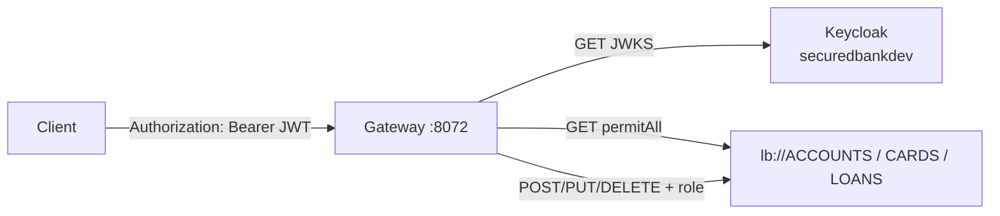

# Spring Cloud Gateway Server


Edge API for `accounts`, `cards`, and `loans`. Routes through Eureka (`lb://…`), rewrites `/accounts|cards|loans/**`, and enforces Keycloak JWT roles on mutating requests.

---

## Specifications

- **Port**: `8072`
- **JWKS**: `http://localhost:7080/realms/securedbankdev/protocol/openid-connect/certs`
- **Routes**: [http://localhost:8072/actuator/gateway/routes](http://localhost:8072/actuator/gateway/routes)
- **Health**: [http://localhost:8072/actuator/health](http://localhost:8072/actuator/health)

---

## Security

OAuth2 resource server. JWT is validated against Keycloak JWKS. `KeycloakRoleConverter` maps `realm_access.roles` to Spring authorities (`ROLE_ACCOUNTS`, `ROLE_CARDS`, `ROLE_LOANS`). CSRF is off. CORS allows the future Vite SPA origin `http://localhost:5173` (Authorization header, common methods).



| Path | Rule |
| :--- | :--- |
| `GET /**` | Permit all |
| `/accounts/**`, `/ACCOUNTS/**` | `ROLE_ACCOUNTS` |
| `/cards/**`, `/CARDS/**` | `ROLE_CARDS` |
| `/loans/**`, `/LOANS/**` | `ROLE_LOANS` |

Realm roles and clients are provisioned in [`infra/`](../infra/README.md) (`ACCOUNTS`, `CARDS`, `LOANS`). SPA login uses public client `securedbank-spa` (PKCE); M2M uses `securedbank-cc`. Example: `POST http://localhost:8072/accounts/api/accounts/create` with a token that includes `ACCOUNTS`.

The React UI will be a **separate** Vite deployment (not Gateway `resources/static`).

---

## Routing & resilience

Path rewrite `(?i)/accounts|cards|loans/(.*)` → `/$1`, then `lb://` the matching service.

- **Accounts**: circuit breaker `accountsCircuitBreaker` → `/accounts-fallback`; GET retry ×3
- **Cards**: GET retry ×3
- **Loans**: GET retry ×3

---

## Local run

Requires Config Server (`8071`), Eureka (`8070`), and Keycloak (`7080`).

```bash
./gradlew clean build
make gateway-restart
```

### Kubernetes (kind)

Manifests: [`k8s/`](k8s/). From repo root: `make k8s-gateway-server`. See [docs/kubernetes.md](../docs/kubernetes.md).
