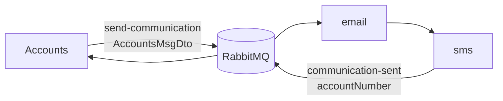

# Message Service


Background worker that sends account communications. No public HTTP API. Consumes create events from Accounts, logs email then SMS, and publishes the account number so Accounts can set `communication_sw`.

---

## Specifications

- **Internal port**: `9010` (not published)
- **Broker**: RabbitMQ `5672` (UI `15672`)
- **Payload**: `AccountsMsgDto` — `accountNumber`, `name`, `email`, `mobileNumber`

Composed function `email|sms`: `email` returns the DTO; `sms` returns `accountNumber`.



| Binding | Destination | Group |
| :--- | :--- | :--- |
| `emailsms-in-0` | `send-communication` | `message` |
| `emailsms-out-0` | `communication-sent` | — |

---

## Local run

RabbitMQ starts as a dependency of `message-up`.

```bash
make message-build
make message-up        # or make message-restart
make watch-message
```
