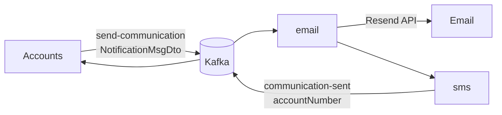

# Message Service


Background worker that sends account notifications. No public HTTP API. Consumes typed events from Accounts, sends email via **Resend**, simulates SMS for account open, and publishes the account number so Accounts can set `communication_sw`.

---

## Specifications

- **Internal port**: `9010` (not published)
- **Broker**: Apache Kafka `9092` host / `19092` Docker (`KAFKA_BROKER`; Compose: `kafka:19092`)
- **Payload**: `NotificationMsgDto` — `type`, `accountNumber`, `name`, `email`, `mobileNumber`, optional `amount` / `balance` / `counterpartyAccount`
- **Types**: `ACCOUNT_OPENED`, `TRANSFER_COMPLETED`, `LOW_BALANCE`

Composed function `email|sms`: `email` sends via Resend (failure fails the function / no ack); `sms` returns `accountNumber` only for `ACCOUNT_OPENED` (otherwise `null` so nothing is published to `communication-sent`).



| Binding | Destination | Group |
| :--- | :--- | :--- |
| `emailsms-in-0` | `send-communication` | `message` |
| `emailsms-out-0` | `communication-sent` | — |

---

## Resend configuration

| Env | Purpose |
| :--- | :--- |
| `RESEND_API_KEY` | API key (required to send; never commit) |
| `RESEND_FROM` | Verified sender (default `Securedbank <onboarding@resend.dev>`) |

**Compose**: export `RESEND_API_KEY` / `RESEND_FROM` before `make message-up`.

**Kubernetes / Helm**: Secret `resend-secret` with keys `RESEND_API_KEY` and `RESEND_FROM`.

```bash
kubectl create secret generic resend-secret \
  --from-literal=RESEND_API_KEY=re_xxx \
  --from-literal=RESEND_FROM='Securedbank <onboarding@resend.dev>'
```

Helm can also create the Secret with `--set resend.createSecret=true --set resend.apiKey=re_xxx` (local only).

---

## Local run

Kafka starts as a dependency of `message-up` (via root compose / [`docker/compose.event.yml`](../docker/compose.event.yml)).

```bash
export RESEND_API_KEY=re_xxx
make message-build
make message-up
```

### Kubernetes (kind)

Manifests: [`k8s/`](k8s/) (`deployment.yml` includes placeholder Secret, ClusterIP `service.yml`). From repo root: `make k8s-message`. Replace `RESEND_API_KEY` before apply. See [docs/kubernetes.md](../docs/kubernetes.md).
