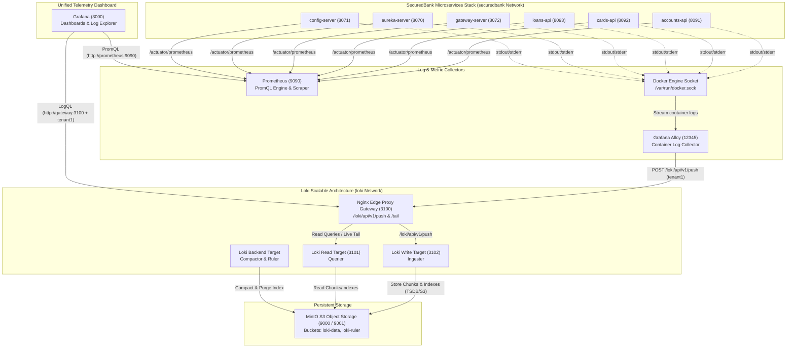

# 📊 SecuredBank Observability & Monitoring Platform

Welcome to the **SecuredBank Observability Platform** documentation. This directory contains the complete infrastructure configuration, log collection pipelines, metric scrapers, and dashboard provisioning setups for monitoring the SecuredBank Microservices environment.

---

## 🏗️ Architecture & Data Flow

The observability stack captures both **metrics** (time-series performance indicators) and **logs** (application stdout/stderr streams) across all 6 core microservices.



---

## 🧩 Observability Components Breakdown

### 1. 📈 Prometheus (`prometheus`)

- **What it is**: An open-source systems monitoring and alerting toolkit built around a time-series database (TSDB) and the **PromQL** query language.
- **Why we use it**: Microservices generate critical numerical telemetry—JVM heap memory, CPU usage, active JDBC connection pools, HTTP response latency distributions, and Resilience4j circuit breaker state transitions. Prometheus periodically pulls and indexes these metrics.
- **How it fits into the stack**:
  - Attached to both the `securedbank` microservices network and the `loki` monitoring network.
  - Every 5 seconds (`scrape_interval: 5s`), it scrapes the `/actuator/prometheus` endpoint exposed by Micrometer in all 6 platform microservices (`accounts-api`, `cards-api`, `loans-api`, `gateway-server`, `eureka-server`, `config-server`).
  - Serves as the primary metric datasource for Grafana (`http://prometheus:9090`).

---

### 2. ⚡ Grafana Alloy (`alloy`)

- **What it is**: Grafana Labs' next-generation, high-performance, lightweight telemetry collector (the modern successor to Promtail and Grafana Agent).
- **Why we use it**: Provides zero-code log harvesting. Instead of requiring applications to log directly to network endpoints or write to custom disk files, Alloy reads stdout/stderr streams directly from `/var/run/docker.sock`.
- **How it fits into the stack**:
  - Runs with access to the local Docker socket.
  - Discovers all container logs dynamically every 5 seconds, relabels raw Docker container names (e.g. `/accounts-api` $\rightarrow$ `container: accounts-api`), and packages logs into structured batches.
  - Forwards log streams via HTTP POST to the Loki Nginx Gateway (`http://gateway:3100/loki/api/v1/push`) under multi-tenant header `X-Scope-OrgID: tenant1`.

---

### 3. 🪵 Grafana Loki (`read`, `write`, `backend`)

- **What it is**: A horizontally scalable, highly available, multi-tenant log aggregation engine inspired by Prometheus. Unlike traditional search engines that index full text, Loki only indexes metadata labels (`container`, `job`, `tenant`), making it lightweight and cost-effective.
- **Why we use it**: Centralizes all microservice, infrastructure, and database log streams into a single queryable store. Enables engineers to search logs using **LogQL** and correlate log traces directly with Prometheus metric spikes.
- **How it fits into the stack**:
  - Configured using Loki's **Microservices Target Architecture** across three dedicated target roles sharing a common configuration ([`loki-config.yml`](file:///Users/baicham/develop/java-projects/master-ms-sb/observability/loki/loki-config.yml)):
    - **Write Target (`write`)**: Ingests incoming log batches from Alloy, processes TSDB index schema (`v13`), and flushes compressed log chunks to S3 storage.
    - **Read Target (`read`)**: Handles query requests and websocket log tails (`/loki/api/v1/tail`) issued by Grafana.
    - **Backend Target (`backend`)**: Runs background table compaction, retention enforcement, and ruler evaluations.
  - Uses `memberlist` gossip protocol (port `7946`) for cluster ring state coordination.

---

### 4. 🔀 Nginx Loki Edge Proxy Gateway (`gateway`)

- **What it is**: A lightweight Nginx reverse proxy serving as the entrypoint for Loki's decoupled microservices target architecture.
- **Why we use it**: Hides the underlying target decomposition (`write` vs. `read` instances) behind a single unified API endpoint (`http://gateway:3100`).
- **How it fits into the stack**:
  - Listens on port `3100` on the `loki` network.
  - Routes write traffic (`/loki/api/v1/push`) to the Loki **Write** target.
  - Routes query and live log tail traffic (`/loki/api/v1/tail`, `/loki/api/v1/query`) to the Loki **Read** target.

---

### 5. 🪣 MinIO S3 Object Storage (`minio`)

- **What it is**: A high-performance, AWS S3-compatible enterprise object storage system running locally.
- **Why we use it**: Provides Cloud-Native durable storage for Loki's TSDB indexes and log chunk files, replacing local filesystem reliance and matching production cloud setups (AWS S3, Google Cloud Storage).
- **How it fits into the stack**:
  - Listens on S3 API port `9000` and Web Console port `9001`.
  - Automatically provisions two buckets: `loki-data` (for chunk/index data) and `loki-ruler` (for alert rules).
  - Authenticates Loki with credentials `loki` / `supersecret`.

---

### 6. 🖼️ Grafana (`grafana`)

- **What it is**: The industry-standard open-source visualization, dashboarding, and log analysis web platform.
- **Why we use it**: Offers a unified "single pane of glass" UI for observing the entire bank platform—combining real-time JVM metrics, circuit breaker status, and live container logs.
- **How it fits into the stack**:
  - Listens on host port `3000` (`http://localhost:3000`).
  - Pre-configured with automatic datasources via [`datasource.yml`](file:///Users/baicham/develop/java-projects/master-ms-sb/observability/grafana/datasource.yml):
    - **Prometheus Datasource**: URL `http://prometheus:9090` (PromQL query engine).
    - **Loki Datasource**: URL `http://gateway:3100` with header `X-Scope-OrgID: tenant1` (LogQL log explorer).

---

## 📌 Ports & Endpoints Reference

| Service | Container Name | Host Port | Internal Port | Purpose / Dashboard |
| :--- | :--- | :--- | :--- | :--- |
| **Grafana** | `master-ms-sb-grafana-1` | `3000` | `3000` | Grafana Web UI (`http://localhost:3000`) |
| **Prometheus** | `prometheus` | `9090` | `9090` | Prometheus UI & Targets (`http://localhost:9090/targets`) |
| **MinIO Console** | `master-ms-sb-minio-1` | `9001` | `9001` | S3 Storage Web Console (`http://localhost:9001`) |
| **MinIO API** | `master-ms-sb-minio-1` | `9000` | `9000` | S3 API Endpoint |
| **Loki Edge Gateway** | `master-ms-sb-gateway-1` | `3100` | `3100` | Unified Loki Push & Query Gateway |
| **Loki Read Target** | `master-ms-sb-read-1` | `3101` | `3100` | Loki Querier |
| **Loki Write Target** | `master-ms-sb-write-1` | `3102` | `3100` | Loki Ingester |
| **Grafana Alloy** | `master-ms-sb-alloy-1` | `12345` | `12345` | Alloy Debug UI (`http://localhost:12345`) |

---

## 📁 Configuration File Map

- **Prometheus Scrape Configuration**: [`observability/prometheus/prometheus.yml`](file:///Users/baicham/develop/java-projects/master-ms-sb/observability/prometheus/prometheus.yml)
- **Grafana Provisioned Datasources**: [`observability/grafana/datasource.yml`](file:///Users/baicham/develop/java-projects/master-ms-sb/observability/grafana/datasource.yml)
- **Loki Engine Configuration**: [`observability/loki/loki-config.yml`](file:///Users/baicham/develop/java-projects/master-ms-sb/observability/loki/loki-config.yml)
- **Alloy Pipeline Definition**: [`observability/alloy/alloy-local-config.yml`](file:///Users/baicham/develop/java-projects/master-ms-sb/observability/alloy/alloy-local-config.yml)
- **Docker Compose Stack**: [`docker-compose-observability.yml`](file:///Users/baicham/develop/java-projects/master-ms-sb/docker-compose-observability.yml)

---

## 🚀 Quick Start & Operations Guide

### Starting the Observability Stack

The observability stack is fully integrated with the main Compose orchestration:

```bash
# Option 1: Start the full banking microservices + observability platform
make all-up

# Option 2: Start standalone observability services
docker compose -f docker-compose-observability.yml up -d
```

### Verification & Testing

1. **Verify Prometheus Targets**:
   Open [http://localhost:9090/targets](http://localhost:9090/targets) to verify all 6 microservice jobs (`accounts`, `cards`, `loans`, `gateway-server`, `eureka-server`, `config-server`) report state **`UP`**.

2. **Explore Logs in Grafana**:
   - Access Grafana at [http://localhost:3000](http://localhost:3000).
   - Navigate to **Explore** $\rightarrow$ select **Loki** datasource.
   - Run a LogQL query:
     ```logql
     {container="accounts-api"}
     ```

3. **Query Metrics in Grafana**:
   - In **Explore** $\rightarrow$ select **Prometheus** datasource.
   - Run PromQL queries such as:
     - `jvm_memory_used_bytes`
     - `http_server_requests_seconds_count`
     - `resilience4j_circuitbreaker_state`

4. **Inspect MinIO S3 Storage**:
   - Access MinIO Console at [http://localhost:9001](http://localhost:9001).
   - Login with Credentials: Username `loki` / Password `supersecret`.
   - Verify `loki-data` bucket contains generated TSDB index and chunk objects.
